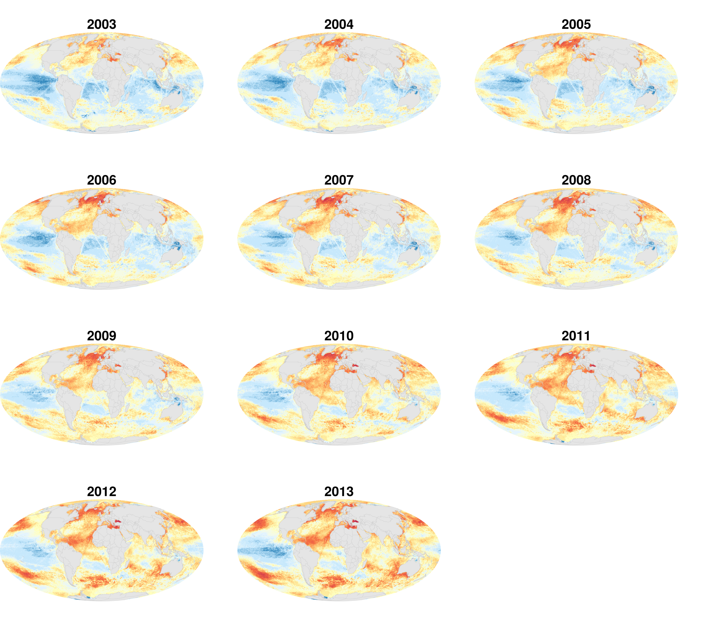

  
```{r, echo = FALSE, message = FALSE, warning = FALSE, error=FALSE, include=FALSE}
library(tidyr)
library(dplyr)
library(raster)
library(RColorBrewer)
library(rgdal)
library(sf)
library(fields)
library(cowplot)
library(ggplot2)
library(here)

source("https://raw.githubusercontent.com/OHI-Science/ohiprep_v2018/gh-pages/src/R/spatial_common.R")

regions_shape <- as(regions, "Spatial")
land <- regions_shape[regions_shape$rgn_type %in% c("land", "land-disputed", "land-noeez", "eez-inland"), ]

```


## Fig S6. Annual change in cumulative human impacts
Annual change in CHI estimated using a linear regression model from 2003 to 2013 for each raster cell.


## Fig S7. Categories of annual change in cumulative impacts 
Categories of annual change in CHI based on linear model estimates of slope from CHI values from 2003 to 2013.  Areas are identified as decreasing CHI (slope < 0), and increasing CHI when: >0, >0.1, and >0.15.

```{r, eval=FALSE, echo = FALSE, message = FALSE, warning = FALSE, error=FALSE, include=FALSE}

trend <- raster::raster(file.path(dir_M, "git-annex/impact_acceleration/impact/trend/chi_slope.tif"))

# slope = 0.0

m <- c(-Inf, 0, -1,   
       0, 0.1, 1,  
       0.1, 0.15, 2,
       0.15, Inf, 3)
rclmat <- matrix(m, ncol=3, byrow=TRUE)

reclassify(trend, rclmat, 
           filename = file.path(dir_M, 'git-annex/impact_acceleration/paper/figures/trend_categories.tif'), overwrite=TRUE, progress="text")

trend_cats <- raster(file.path(dir_M, 'git-annex/impact_acceleration/paper/figures/trend_categories.tif'))
freq(trend_cats)

# ocean: 416190801
77581546/416190801 #18.6% decreasing
(48078341+15149943)/416190801 # 15.2% 0.1 or greater trend
15149943/416190801 # 3.6% 0.15 or greater trend


```

```{r, eval=FALSE, echo = FALSE, message = FALSE, warning = FALSE, error=FALSE, include=FALSE}

trend_cats <- raster(file.path(dir_M, 'git-annex/impact_acceleration/paper/figures/trend_categories.tif'))
my_breaks <- c(-1, 0, 1, 2, 3)
# blue, light brown , black , red
cols = c( "#3692b8", "#db7d3f", "#cc0a5a", "#42342b")
labels=c("<0", ">0\n<0.1", ">0.1\n<0.15", ">0.15")

legend.shrink <- 0.7
legend.width <- 0.5
png("paper/figures/trend/chi_trend_categories.png", res=500, width=7, height=5, units="in") 
par(mar=c(1, 1, 1, 1))
par(oma=c(0,0,0,0))
plot(trend_cats, col=cols, axes=FALSE, box=FALSE, breaks=my_breaks, legend=FALSE)
# add axis with fields package function:
def_breaks <- c(0, 1, 2, 3, 4)
fields::image.plot(trend_cats, #zlim = c(min(myBreaks), max(myBreaks)), 
           legend.only = TRUE, 
           legend.shrink=legend.shrink,
           legend.width=legend.width,
           col = cols,
           breaks=def_breaks,
           #lab.breaks=labels,
           axis.args = list(cex.axis = 0.8, at=c(0.5, 1.5, 2.5, 3.5), labels=labels))
plot(land, add=TRUE, border="gray80", col="gray90", lwd=0.5)
dev.off()

```


## Fig S8. CHI from 2008 to 2013
Cumulative human impact maps from 2003 to 2013.

```{r chi_map, eval=FALSE, echo = FALSE, message = FALSE, warning = FALSE, error=FALSE, include=FALSE}

## function to make plots

legend.shrink <- 0.7
legend.width <- 0.7

## following variables from Figures.Rmd
chi_breaks <-  c(-1, 0.1, 0.2, 0.4, 0.6, 0.8, 1, 1.25, 1.5, 1.75, 2, 2.5, 3, 3.5, 4.0, 5, 100)
chi_cols <- c("#9E0142", "#B91F48", "#D53E4F", "#F46D43", "#FDAE61", "#FEE08B", "#FFFFBF", "#EFF9FF", "#BDE4FC", "#3288BD")
chi_cols = rev(colorRampPalette(chi_cols)(length(chi_breaks)-1)) 
chi_legend_labels <- c(0, 0.2, 0.6, 1, 1.5, 2, 3, 4.0, ">5")
chi_label_sequence <- c(1, 3,  5,   7, 9,  11, 13, 15, 17)

source(here("paper/figures/chi_plot_function.R"))

for(year in 2003:2013){ # year = 2013
png(here(sprintf("paper/figures/chi_maps/year_labels/chi_%s.png", year)), res=500, width=6, height=3, units="in")  
p_rast <- raster(file.path(dir_M, sprintf("git-annex/impact_acceleration/impact/cumulative_impact/chi_%s.tif", year)))
chi_plot(raster_data=p_rast,  title=year, title_size = 2, 
              cols=chi_cols, color_breaks = chi_breaks,
              legend_break_labels = chi_legend_labels, 
         label_sequence = chi_label_sequence,
         legend=FALSE, condensed=TRUE)
dev.off()
}

chi2003 <- ggdraw() + draw_image(here("paper/figures/chi_maps/year_labels/chi_2003.png"))
chi2004 <- ggdraw() + draw_image(here("paper/figures/chi_maps/year_labels/chi_2004.png"))
chi2005 <- ggdraw() + draw_image(here("paper/figures/chi_maps/year_labels/chi_2005.png"))
chi2006 <- ggdraw() + draw_image(here("paper/figures/chi_maps/year_labels/chi_2006.png"))
chi2007 <- ggdraw() + draw_image(here("paper/figures/chi_maps/year_labels/chi_2007.png"))
chi2008 <- ggdraw() + draw_image(here("paper/figures/chi_maps/year_labels/chi_2008.png"))
chi2009 <- ggdraw() + draw_image(here("paper/figures/chi_maps/year_labels/chi_2009.png"))
chi2010 <- ggdraw() + draw_image(here("paper/figures/chi_maps/year_labels/chi_2010.png"))
chi2011 <- ggdraw() + draw_image(here("paper/figures/chi_maps/year_labels/chi_2011.png"))
chi2012 <- ggdraw() + draw_image(here("paper/figures/chi_maps/year_labels/chi_2012.png"))
chi2013 <- ggdraw() + draw_image(here("paper/figures/chi_maps/year_labels/chi_2013.png"))

plot_grid(chi2003, chi2004, chi2005,
          chi2006, chi2007, chi2008,
          chi2009, chi2010, chi2011,
          chi2012, chi2013,
          nrow=4)
ggsave(here("paper/figures/chi_maps/year_labels/chi_all_years.png"), dpi=300, width=8, height=7, units=c("in"))

```



## Fig S9. SST influence on cumulative impact and trend 
Sea surface temperature was, by far, the largest driver of global cumulative impacts (top; 2013 data) and annual change in cumulative impacts (middle; linear model of change in CHI from 2003-2013). However, most of the ocean is experiencing increasing impacts, even when SST is excluded (bottom, red indicates increasing CHI, blue decreasing CHI, and white no statistically significant pattern, P > 0.05). Left figures exclude SST and right figures include SST.


```{r, eval=FALSE, echo = FALSE, message = FALSE, warning = FALSE, error=FALSE, include=FALSE}

# create CHI raster without SST
chi <- raster(file.path(dir_M, "git-annex/impact_acceleration/impact/cumulative_impact/chi_2013.tif"))
sst <- raster(file.path(dir_M, "git-annex/impact_acceleration/impact/stressor_impact/sst_2013.tif"))

chi_sst <- stack(chi, sst)
overlay(chi_sst, fun=function(x,y){x - y}, 
                    filename = file.path(dir_M, 'git-annex/impact_acceleration/paper/figures/chi_minus_sst.tif'), overwrite=TRUE, progress="text")

```

```{r chi_no_sst, eval=FALSE, echo = FALSE, message = FALSE, warning = FALSE, error=FALSE, include=FALSE}

# make plot using CHI - SST raster:
source(here("paper/figures/chi_plot_function.R"))

legend.shrink <- 0.7
legend.width <- 0.7

chi_no_sst <- raster(file.path(dir_M, 'git-annex/impact_acceleration/paper/figures/chi_minus_sst.tif'))

png("paper/figures/chi_maps/chi_noSST.png", res=600, width=6, height=3, units="in")  
chi_plot(raster_data=chi_no_sst,  
              color_breaks=chi_breaks, cols=chi_cols, legend_break_labels=chi_legend_labels, title="", legend=TRUE)
dev.off()

```

```{r trend_map_noSST, eval=FALSE, echo = FALSE, message = FALSE, warning = FALSE, error=FALSE, include=FALSE}

# chi no_sst
chi_slope <- raster(file.path(dir_M, 'git-annex/impact_acceleration/impact/trend/chi_slope.tif'))
sst_slope <- raster(file.path(dir_M, 'git-annex/impact_acceleration/impact/trend/impacts/sst_trend.tif'))

chi_sst_slope <- stack(chi_slope, sst_slope)
overlay(chi_sst_slope, fun=function(x,y){x - y}, 
                    filename = file.path(dir_M, 'git-annex/impact_acceleration/paper/figures/chi_minus_sst_trend.tif'), overwrite=TRUE, progress="text")
```


```{slope_no_sst_plot, eval=FALSE, echo = FALSE, message = FALSE, warning = FALSE, error=FALSE, include=FALSE}

source(here("paper/figures/chi_plot_function.R"))

## plot the raster
slope_noSST <- raster(file.path(dir_M, 'git-annex/impact_acceleration/paper/figures/chi_minus_sst_trend.tif'))
slope <- raster(file.path(dir_M, 'git-annex/impact_acceleration/impact/trend/chi_slope.tif'))
overlay <- raster(file.path(dir_M, "git-annex/impact_acceleration/no_sst/trend/sig_overlay.tif"))

png("paper/figures/trend/chi_trend_minus_sst_scaled_2_chi.png", 
    res=500, width=6, height=3, units="in")  
trend_plot(slope_noSST, scaleRaster=slope, overlay_rast=overlay, overlay=FALSE, legend=TRUE)
  dev.off()
  
png("paper/figures/trend/chi_trend_minus_sst.png", 
    res=500, width=6, height=3, units="in")  
trend_plot(slope_noSST, scaleRaster=slope_noSST, overlay_rast=overlay, overlay=FALSE, legend=TRUE)
  dev.off()  

```


```{r trend_patterns, eval=FALSE, echo = FALSE, message = FALSE, warning = FALSE, error=FALSE, include=FALSE}

trend_cats <- raster(file.path(dir_M, 'git-annex/impact_acceleration/impact/trend/trend_pattern.tif'))
my_breaks <- c(-2, -1, 0, 2)

cols = c( "#3692b8", "#f4f6f7", "#cc0a5a")
labels=c("decreasing", "no sig.\nchange", "increasing")

legend.shrink <- 0.7
legend.width <- 0.7
png("paper/figures/trend/chi_trend_pattern.png", res=500, width=6, height=3, units="in") 
par(mar=c(1, 1, 1, 2))
par(oma=c(0,0,0,0))
plot(trend_cats, col=cols, axes=FALSE, box=FALSE, breaks=my_breaks, legend=FALSE)
# add axis with fields package function:
def_breaks <- c(0, 1, 2, 3)
fields::image.plot(trend_cats, #zlim = c(min(myBreaks), max(myBreaks)), 
           legend.only = TRUE, 
           legend.shrink=legend.shrink,
           legend.width=legend.width,
           col = cols,
           breaks=def_breaks,
           #lab.breaks=labels,
           axis.args = list(cex.axis = 0.6, at=c(0.5, 1.5, 2.5), labels=labels))
plot(land, add=TRUE, border="gray80", col="gray90", lwd=0.5)
dev.off()


### no SST
trend_cats <- raster(file.path(dir_M, 'git-annex/impact_acceleration/no_sst/trend/trend_pattern.tif'))
my_breaks <- c(-2, -1, 0, 2)

cols = c( "#3692b8", "#f4f6f7", "#cc0a5a")
labels=c("decreasing", "no sig.\nchange", "increasing")

legend.shrink <- 0.7
legend.width <- 0.7
png("paper/figures/trend/chi_trend_no_sst_pattern.png", res=500, width=6, height=3, units="in") 
par(mar=c(1, 1, 1, 2))
par(oma=c(0,0,0,0))
plot(trend_cats, col=cols, axes=FALSE, box=FALSE, breaks=my_breaks, legend=FALSE)
# add axis with fields package function:
def_breaks <- c(0, 1, 2, 3)
fields::image.plot(trend_cats, #zlim = c(min(myBreaks), max(myBreaks)), 
           legend.only = TRUE, 
           legend.shrink=legend.shrink,
           legend.width=legend.width,
           col = cols,
           breaks=def_breaks,
           #lab.breaks=labels,
           axis.args = list(cex.axis = 0.6, at=c(0.5, 1.5, 2.5), labels=labels))
plot(land, add=TRUE, border="gray80", col="gray90", lwd=0.5)
dev.off()

```

## Fig S10. Impact of SST from 2003-2017
The following are the SST impacts from 2003-2017.  CHI estimates only include data up to 2013, during which time the SST impact was relaxed in some regions.  These data indicate these regions of low impact do not persist into the future. 

```{r 3nm_eez_trend_circleplot, eval=FALSE, echo = FALSE, message = FALSE, warning = FALSE, error=FALSE, include=FALSE}

sst1 <- list.files(file.path(dir_M, "git-annex/impact_acceleration/impact/stressor_impact"), full=TRUE, pattern="sst")
sst2 <- list.files(file.path(dir_M, "git-annex/impact_acceleration/no_sst/stressor_impact"), full=TRUE)
sst_files <- c(sst1, sst2)

impact_breaks <-  c(-0.01, 0.2, 0.4, 0.6, 0.8, 1, 1.2, 1.4, 1.6, 1.8, 2, 2.2, 2.4, 2.6, 2.8, 3.01)
impact_cols <- c("#9E0142", "#B91F48", "#D53E4F", "#F46D43", "#FDAE61", "#FEE08B", "#fcfcea", "#d0e4ef")  ## note for future: replace last one with this "#b9e0f7"
impact_cols = rev(colorRampPalette(impact_cols)(length(impact_breaks)-1)) 
impact_legend_labels <- c(0, 1, 2, 3)
impact_label_sequence <- c(1, 6,  11,  16)


legend.shrink <- 0.7 
legend.width <- 0.7

source(here("paper/figures/chi_plot_function.R"))


# make latest year with legend:
year = 2017
sst_file <- grep(year, sst_files, value=TRUE)  
sst_rast <- raster(sst_file)

png(here(sprintf("paper/figures/impacts/sst/sst_legend.png", year)), res=500, width=6, height=3, units="in")  
chi_plot(sst_rast, title=year, 
                       color_breaks=impact_breaks, cols=impact_cols, title_size = 2,
                       legend_break_labels=impact_legend_labels, 
                       label_sequence = impact_label_sequence,
                       legend=TRUE, condensed=FALSE)
dev.off()

for(year in 2003:2017){ #year = 2016
sst_file <- grep(year, sst_files, value=TRUE)  
sst_rast <- raster(sst_file)

png(here(sprintf("paper/figures/impacts/sst/sst_%s.png", year)), res=500, width=6,
height=3, units="in")  
    chi_plot(sst_rast, title=year, title_size = 2, title_legend=NULL, 
                       color_breaks=impact_breaks, cols=impact_cols,
                       legend_break_labels=impact_legend_labels, legend=FALSE,
                     condensed=TRUE)
dev.off()
}


sst2003 <- ggdraw() + draw_image(here("paper/figures/impacts/sst/sst_2003.png"))
sst2004 <- ggdraw() + draw_image(here("paper/figures/impacts/sst/sst_2004.png"))
sst2005 <- ggdraw() + draw_image(here("paper/figures/impacts/sst/sst_2005.png"))
sst2006 <- ggdraw() + draw_image(here("paper/figures/impacts/sst/sst_2006.png"))
sst2007 <- ggdraw() + draw_image(here("paper/figures/impacts/sst/sst_2007.png"))
sst2008 <- ggdraw() + draw_image(here("paper/figures/impacts/sst/sst_2008.png"))
sst2009 <- ggdraw() + draw_image(here("paper/figures/impacts/sst/sst_2009.png"))
sst2010 <- ggdraw() + draw_image(here("paper/figures/impacts/sst/sst_2010.png"))
sst2011 <- ggdraw() + draw_image(here("paper/figures/impacts/sst/sst_2011.png"))
sst2012 <- ggdraw() + draw_image(here("paper/figures/impacts/sst/sst_2012.png"))
sst2013 <- ggdraw() + draw_image(here("paper/figures/impacts/sst/sst_2013.png"))
sst2014 <- ggdraw() + draw_image(here("paper/figures/impacts/sst/sst_2014.png"))
sst2015 <- ggdraw() + draw_image(here("paper/figures/impacts/sst/sst_2015.png"))
sst2016 <- ggdraw() + draw_image(here("paper/figures/impacts/sst/sst_2016.png"))
sst2017 <- ggdraw() + draw_image(here("paper/figures/impacts/sst/sst_2017.png"))


plot_grid(sst2003, sst2004, sst2005,
          sst2006, sst2007, sst2008,
          sst2009, sst2010, sst2011,
          sst2012, sst2013, sst2014,
          sst2015, sst2016, sst2017,
          nrow=5)
ggsave(here("paper/figures/impacts/sst/sst_all_years.png"), dpi=300, width=8, height=9, units=c("in"))


```

## Fig S11. Annual change in impacts for countries excluding SST 
Annual change in impacts for 3nm offshore area for 220 countries.  Sea surface temperature is excluded to explore the influence of the remaining impacts.


```{r 3nm_eez_trend_circleplot, eval=FALSE, echo = FALSE, message = FALSE, warning = FALSE, error=FALSE, include=FALSE}

# UN georegions
un_rgn <- UNgeorgn_nm %>%
  dplyr::select(rgn_id, georegion = r1_label)

# calculate CHI trend for each region
# get impact data
chi <- read.csv("paper/zonal_data_eez/eez_3nm_impacts_trend.csv") %>% 
  filter(!(pressure %in% c("sst"))) %>%
  group_by(rgn_id, rgn_name) %>%
  summarize(chi = sum(value)) %>%
  left_join(un_rgn)

# get georegion ranks based on mean chi values, and use to rank chi data
rank_georgn <- chi %>%
  group_by(georegion) %>%
  summarize(mean_chi = mean(chi),
            count = length(chi)) %>%
  arrange(mean_chi)

chi$georegion <- factor(chi$georegion, levels=rank_georgn$georegion)


### Organize the chi data and add a few extra variables to help plotting
# Including empty spaces to add a y-axes

rank_rgn <- chi %>%
  arrange(georegion, chi)

# add empty space
empty_bar <- 6
to_add <- data.frame(matrix(NA, empty_bar, ncol(rank_rgn)) )
colnames(to_add) = colnames(rank_rgn)
to_add$rgn_name <- as.character(1:empty_bar)
rank_rgn  <- bind_rows(to_add, rank_rgn)

# modify region names to be shorter
rank_rgn <- rank_rgn %>%
  dplyr::mutate(rgn_name_short = rgn_name, 
         rgn_name_short = gsub("Islands", "Isl", rgn_name_short),
         rgn_name_short = gsub("Island", "Isl", rgn_name_short),
         rgn_name_short = gsub("Democratic", "Dem", rgn_name_short),
         rgn_name_short = gsub("Republic", "Rep", rgn_name_short),
         rgn_name_short = gsub("South", "S", rgn_name_short),
         rgn_name_short = gsub("American", "Am", rgn_name_short),
         rgn_name_short = gsub("the United States", "US", rgn_name_short),
         rgn_name_short = gsub("Territory", "Terr", rgn_name_short),
         rgn_name_short = gsub("Saint", "St", rgn_name_short),
         rgn_name_short = gsub(" and ", " & ", rgn_name_short),
         rgn_name_short = gsub("Republique", "Rep", rgn_name_short),
         rgn_name_short = gsub("Dem Rep of the", "Dem Rep of", rgn_name_short),
         rgn_name_short = gsub("Georgia and the", "Georgia and", rgn_name_short),
         rgn_name_short = gsub("St Vincent and the", "St Vincent and", rgn_name_short),
         rgn_name_short = gsub("Howland Isl & Baker Isl", "Howland & Baker Isl", rgn_name_short),
         rgn_name_short = gsub("Northern", "N", rgn_name_short), 
         rgn_name_short = gsub("Reunion", "Reunion", rgn_name_short),
         rgn_name_short = gsub("Qatar", "Qatar      ", rgn_name_short))


# some code to orient the country labels
sequence_length = length(unique(rank_rgn$rgn_name))
first_sequence = c(1:(sequence_length%/%2)) 
second_sequence = c((sequence_length%/%2+1):sequence_length) 
first_angles = c(90 - 180/length(first_sequence) * first_sequence)
second_angles = c(-90 - 180/length(second_sequence) * second_sequence)

rank_rgn$angle <- c(first_angles,second_angles)
rank_rgn$hjust <- c(rep(0, length(first_sequence)), 
                       rep(1, length(second_sequence)))

# color for region labels
rank_rgn <- rank_rgn %>%
  mutate(rgn_name = factor(rgn_name, unique(rgn_name))) %>%
  mutate(georegion = factor(georegion, unique(georegion))) %>%
  mutate(color = "black") %>%
  mutate(color = ifelse(is.na(chi), "white", color))


########### marking georegions

# add column to identify when georegion changes
rgn_shift <- rank_rgn %>%
  mutate(georegion = ifelse(is.na(georegion), "tmp", georegion)) %>%
  mutate(georegion = as.factor(georegion)) %>%
  mutate(region_shift = as.numeric(georegion) - lag(as.numeric(georegion)), default=first(as.numeric(georegion)))

rgn_shift <- which(rgn_shift$region_shift > 0)
rgn_shift <- c(1, rgn_shift) -0.5
rgn_shift <- data.frame(rgn_shift_x=rgn_shift,
                        georegion = rank_georgn$georegion,
                        name_x= c(29, 53, 78, 124, 140, 160, 205), # 140
                        name_y=c(0.07, 0.07, 0.07, 0.07, 0.07, 0.07, 0.07))
rgn_shift <- rgn_shift %>%
  mutate(georegion = as.character(georegion)) %>%
  mutate(georegion = ifelse(georegion == "Latin America and the Caribbean", "Latin America\nand\nCaribbean",
                            georegion))

# get impact data
impacts <- read.csv("paper/zonal_data_eez/eez_3nm_impacts_trend.csv") %>%
  filter(!(pressure %in% c("sst"))) %>%
  left_join(un_rgn)

# ## add some blanks to separate groups
to_add <-  data.frame( matrix(NA, empty_bar*nlevels(as.factor(impacts$pressure)), ncol(impacts)) )
colnames(to_add) <- colnames(impacts)
to_add$pressure <- rep(levels(as.factor(impacts$pressure)), each=empty_bar)
to_add$value <-  0
to_add$rgn_name <- as.character(rep(1:empty_bar, nlevels(as.factor(impacts$pressure)))) 

impacts <- bind_rows(to_add, impacts, to_add)


## rank of pressure categories
impacts %>%
  group_by(pressure) %>%
  summarize(mean = mean(value)) %>%
  arrange(mean)

pressure_name <- data.frame(pressure = c("sst", "slr", "oa", 
                                                  "shipping",
                                                  "light", "nutrient", "direct_human", "organic",
                                                  "pel_hb", "dem_nondest_hb","pel_lb", 
                                                  "dem_nondest_lb", "dem_dest", "art_fish"),
                            pressure_name = c("sst", "slr", "oa",
                                              "shipping", "light pollution", 
                                              "nutrient pollution", "direct human", "organic pollution",  
                                              "comm fish: pel hb", "comm fish: dem nondest hb", "comm fish: pel lb", 
                                              "comm fish: dem nondest lb", "comm fish: dem dest", "artisanal fishing"))

impacts <- impacts %>%
  left_join(pressure_name, by = "pressure")

impacts$pressure_name <- factor(impacts$pressure_name, levels=rev(pressure_name$pressure_name))
impacts$rgn_name <- factor(impacts$rgn_name, levels=unique(rank_rgn$rgn_name))


library(beyonce)

myPalette <- c(beyonce_palette(18, 15, type=c("continuous"))[1:6],
               beyonce_palette(18, 25, type=c("continuous"))[15:18],
               beyonce_palette(18, 15, type=c("continuous"))[8],
               beyonce_palette(18, 20, type=c("continuous"))[16:18])
               

## some theme stuff to make the circle plot look nice

circle_theme <- theme(axis.line=element_blank(),
      axis.text.y=element_blank(),
      axis.ticks=element_blank(),
      axis.title.x=element_blank(),
      axis.title.y=element_blank(),
      legend.position="none",
      panel.background=element_blank(),
      panel.border=element_blank(),
      panel.grid.major=element_blank(),
      panel.grid.minor=element_blank(),
      plot.background=element_blank(),
      axis.text.x = element_blank())

# circle plot
# https://www.r-graph-gallery.com/299-circular-stacked-barplot/
p <- ggplot(data=impacts, aes(x=rgn_name, y=value, fill=pressure_name)) + 
  geom_bar(stat="identity") +
  geom_errorbar(aes(x = 1, ymin = -0.13, ymax=0.13), alpha=0)  +
  geom_text(data=rank_rgn, aes(x=rgn_name, y=0.11, label=rgn_name_short, angle=angle, hjust=hjust, color=color), inherit.aes = FALSE) +
  geom_segment(x = 5, y = 0, xend = dim(rank_rgn)[1]+1, yend = 0, colour = "black", alpha=1, size=0.5) +
  geom_segment(x = 7, y = -0.05, xend = dim(rank_rgn)[1]-1, yend = -0.05, colour = "gray", alpha=1, size=0.5) +
  annotate("text", x = c(3,3,3,3), y = c(-0.05, 0, 0.05, 0.1), label = c(-0.05, 0, 0.05, 0.1), color="darkgrey", angle=-8, size=4) +
  scale_colour_identity() +
  scale_fill_manual(values=myPalette) +
  coord_polar() +
  geom_segment(data = rgn_shift, aes(x=rgn_shift_x, xend=rgn_shift_x, y=rep(-0.05, dim(rgn_shift)[1]), yend=rep(0.11, dim(rgn_shift)[1])), colour="gray", size=0.5, inherit.aes=FALSE) +
geom_text(data=rgn_shift, aes(x=name_x, y=name_y, label=georegion), inherit.aes=FALSE, size=5) +
  #geom_point(data=chi, aes(y=chi, x=rgn_name), fill="black", shape="|", size=2.5) +
  circle_theme

p
ggsave('paper/figures/trend/eez_3nm_trend_no_sst_circleplot.jpg', height=18, width=18, units=c("in"))

# ### Save the legend (need to crop outside R)
# p <- ggplot(data=impacts, aes(x=rgn_name, y=value, fill=pressure_name)) +
#   geom_bar(stat="identity") +
#   geom_errorbar(aes(x = 1, ymin = -0.13, ymax=0.08), alpha=0)  +
#   geom_text(data=rank_rgn, aes(x=rgn_name, y=0.08, label=rgn_name_short, angle=angle, hjust=hjust, color=color), inherit.aes = FALSE) +
#   geom_segment(x = 5, y = 0, xend = dim(rank_rgn)[1]+1, yend = 0, colour = "black", alpha=1, size=0.5) +
#   geom_segment(x = 7, y = -0.05, xend = dim(rank_rgn)[1]-1, yend = -0.05, colour = "gray", alpha=1, size=0.5) +
#   annotate("text", x = c(3,3,3,3), y = c(-0.05, 0, 0.05, 0.075), label = c(-0.05, 0, 0.05, 0.075), color="darkgrey", angle=-8, size=4) +
#   scale_colour_identity() +
#   scale_fill_manual(values=myPalette) +
#   coord_polar() +
#   geom_segment(data = rgn_shift, aes(x=rgn_shift_x, xend=rgn_shift_x, y=rep(-0.05, dim(rgn_shift)[1]), yend=rep(0.1, dim(rgn_shift)[1])), colour="gray", size=0.5, inherit.aes=FALSE) +
# geom_text(data=rgn_shift, aes(x=name_x, y=name_y, label=georegion), inherit.aes=FALSE, size=5)
#   #geom_point(data=chi, aes(y=chi, x=rgn_name), fill="black", shape="|", size=2.5) +
#   #circle_theme
# 
# ggsave('paper/figures/trend/legend_eez_3nm_trend_no_sst.jpg', height=18, width=18, units=c("in"))

###
ggdraw() + 
  draw_image(here("paper/figures/trend/eez_3nm_trend_no_sst_circleplot.jpg"), 0, 0, 1, 1) +
 draw_image(here("paper/figures/trend/legend_eez_3nm_trend_no_sst.jpg"), scale=0.35, x=.34, y=-0.25)

ggsave("paper/figures/trend/trend_circle_no_sst_legend.png", dpi=300, width=30, height=18, units=c("in"))

```


## Fig S12. Country annual change in cumulative impacts vs. cumulative impacts without SST 
Comparison of annual change in cumulative impacts when sea surface temperature is included vs. excluded.  Most countries have increasing cumulative impacts even when sea surface temperature is excluded, but the magnitude of change is much smaller.  Red solid line indicates 1:1 relationship.

```{r, echo = FALSE, message = FALSE, warning = FALSE, error=FALSE}

all <- read.csv(here("paper/zonal_data_eez/eez_3nm_impacts_trend.csv")) 

no_cc <- all %>%
  filter(!(pressure %in% c("sst"))) %>%
  group_by(rgn_id, rgn_name) %>%
  summarize(chi_trend_no_cc = sum(value))

chi <- read.csv(here("paper/zonal_data_eez/eez_chi_3nm_trend.csv"))
compare <- left_join(chi, no_cc)

ggplot(compare, aes(y=chi_trend_no_cc, x=value)) +
  geom_point() +
  ylab("annual change in chi, no sst") +
  xlab("annual change in chi") +
  geom_abline(slope=1, intercept=0, color="red")
ggsave(here("paper/figures/rgn_trend_chi_vs_no_sst.png"), height=4, width=6, units=c("in"))

```

## Fig S13. Individual impacts
Global maps of the 14 impacts from 2013.  Impacts are separated by major groups: climate change, shipping, land-based, and fishing (commercial and artisanal).  Color scales are independent of one another so relative spatial variation can be visualized.    

```{r, eval=FALSE, echo = FALSE, message = FALSE, warning = FALSE, error=FALSE, include=FALSE}


# function all values ind_scale
global_plot_ind_scale_function <- function(plotRast, cols=cols, title = "", saveFile, include_legend=TRUE){

png(sprintf("paper/figures/impacts/global/%s.png",  saveFile), 
    res=500, width=7, height=3.3, units="in")  
  par(mar=c(0.1,1,1,1)) # bottom, left, top, and right
  par(oma=c(0,0,0,0))

plot(plotRast, col=cols, legend=FALSE, axes=FALSE, box=FALSE)

  title(main=list(title, cex=1.2), line=0)

  plot(land, add=TRUE, border="gray80", col="gray90", lwd=0.5)

  if(include_legend){
par(mfrow=c(1, 1), mar=c(2, 0, 1, 0), new=FALSE)
plot(plotRast, legend.only=TRUE, legend.shrink=.8, legend.width=.5, col=cols, axis.args = list(cex.axis = 0.6))
}
  dev.off()
}


# labels
pressure_name <- data.frame(pressure = c("sst", "slr", "oa", 
                                                  "shipping",
                                                  "light", "nutrient", "direct_human", "organic",
                                                  "pel_hb", "dem_nondest_hb","pel_lb", 
                                                  "dem_nondest_lb", "dem_dest", "art_fish"),
                            pressure_name = c("sst", "slr", "oa",
                                              "shipping", "light pollution", 
                                              "nutrient pollution", "direct human", "organic pollution",  
                                              "comm fish: pel hb", "comm fish: dem nondest hb", "comm fish: pel lb", 
                                              "comm fish: dem nondest lb", "comm fish: dem dest", "artisanal fishing"))


my_cols = brewer.pal(11, 'Spectral')[1:10] 
my_cols = rev(colorRampPalette(my_cols)(255)) 
my_cols[1] <- "#3288BD66"

impact_files <- list.files(file.path(dir_M, "git-annex/impact_acceleration/impact/stressor_impact"), pattern="2013", full=TRUE)

for(impact_file in impact_files){ # impact_file = impact_files[1]
saveName <-   gsub(".tif", "", basename(impact_file))
pretitleName <- gsub("_2013", "", saveName)
titleName <- as.character(pressure_name$pressure_name[pressure_name$pressure == pretitleName]) 

global_plot_ind_scale_function(plotRast=raster(impact_file), cols=my_cols, saveFile=saveName, title=titleName, include_legend=TRUE)

}

```

#### Climate Change

```{r, echo = FALSE, message = FALSE, warning = FALSE, error=FALSE, include=FALSE}

sst <- ggdraw() + draw_image(here("paper/figures/impacts/global/sst_2013.png"))

oa <- ggdraw() + draw_image(here("paper/figures/impacts/global/oa_2013.png"))

slr <- ggdraw() + draw_image(here("paper/figures/impacts/global/slr_2013.png"))

plot_grid(sst, oa, slr, nrow=1, labels=c("", ""))
ggsave(here("paper/figures/impacts/global/cc.png"), dpi=300, width=8, height=2.2, units=c("in"))

```


#### Shipping
```{r, echo = FALSE, message = FALSE, warning = FALSE, error=FALSE, include=FALSE}

shipping <- ggdraw() + draw_image(here("paper/figures/impacts/global/shipping_2013.png"))

plot_grid(shipping, NULL, nrow=1, labels=c("", ""))
ggsave(here("paper/figures/impacts/global/shipping.png"), dpi=300, width=8, height=2.2, units=c("in"))

```


#### Land-based
```{r, echo = FALSE, message = FALSE, warning = FALSE, error=FALSE, include=FALSE}

organic <- ggdraw() + draw_image(here("paper/figures/impacts/global/organic_2013.png"))

nutrient <- ggdraw() + draw_image(here("paper/figures/impacts/global/nutrient_2013.png"))

human <- ggdraw() + draw_image(here("paper/figures/impacts/global/direct_human_2013.png"))

light <- ggdraw() + draw_image(here("paper/figures/impacts/global/light_2013.png"))

plot_grid(organic, nutrient, human, light, nrow=2, labels=c("", "", "", ""))
ggsave(here("paper/figures/impacts/global/land_based.png"), dpi=300, width=8, height=4.4, units=c("in"))
```

#### Fishing

```{r, echo = FALSE, message = FALSE, warning = FALSE, error=FALSE, include=FALSE}

artisanal <- ggdraw() + draw_image(here("paper/figures/impacts/global/art_fish_2013.png"))
dd <- ggdraw() + draw_image(here("paper/figures/impacts/global/dem_dest_2013.png"))

dnd_hb <- ggdraw() + draw_image(here("paper/figures/impacts/global/dem_nondest_hb_2013.png"))
dnd_lb <- ggdraw() + draw_image(here("paper/figures/impacts/global/dem_nondest_lb_2013.png"))

pel_hb <- ggdraw() + draw_image(here("paper/figures/impacts/global/pel_hb_2013.png"))
pel_lb <- ggdraw() + draw_image(here("paper/figures/impacts/global/pel_lb_2013.png"))

plot_grid(artisanal, dd, dnd_hb, dnd_lb, pel_hb, pel_lb, nrow=3, labels=c("", "", "", "", "", ""))
ggsave(here("paper/figures/impacts/global/fishing.png"), dpi=300, width=8, height=6.6, units=c("in"))
```

## Fig S14. Individual impact trends
Global maps of the change in impact from 2003 to 2013 for the 14 impacts.  Impacts are separated by major groups: climate change, shipping, land-based, and fishing (commercial and artisanal).  Color scales are independent of one another so relative spatial variation can be visualized.    

```{r, eval=FALSE, echo = FALSE, message = FALSE, warning = FALSE, error=FALSE, include=FALSE}

# function all values ind_scale
global_plot_trend_ind_scale_function <- function(plotRast, cols=cols, title = "", saveFile, include_legend=TRUE){

png(sprintf("paper/figures/trend/impacts/ind_scale/%s.png",  saveFile), 
    res=500, width=7, height=3.3, units="in")  
  par(mar=c(0.1,1,1,1)) # bottom, left, top, and right
  par(oma=c(0,0,0,0))

scaleValue <- max(abs(minValue(plotRast)), abs(maxValue(plotRast)))  

plot(plotRast, col=cols, 
          breaks=seq(-scaleValue, scaleValue, length.out=255),
     legend=FALSE, axes=FALSE, box=FALSE)

  title(main=list(title, cex=1.2), line=0)

  plot(land, add=TRUE, border="gray80", col="gray90", lwd=0.5)

  if(include_legend){
par(mfrow=c(1, 1), mar=c(2, 0, 1, 0), new=FALSE)
plot(plotRast,  breaks=seq(-scaleValue, scaleValue, length.out=255),
     legend.only=TRUE, legend.shrink=.8, legend.width=.5, col=cols, axis.args = list(cex.axis = 0.6,
                                                                    at= c(-scaleValue, 0, scaleValue),
                                                                  labels=c(round(-scaleValue, 2), 0, round(scaleValue, 2))))
}
  dev.off()
}


# labels
pressure_name <- data.frame(pressure = c("sst", "slr", "oa", 
                                                  "shipping",
                                                  "light", "nutrient", "direct_human", "organic",
                                                  "pel_hb", "dem_nondest_hb","pel_lb", 
                                                  "dem_nondest_lb", "dem_dest", "art_fish"),
                            pressure_name = c("sst", "slr", "oa",
                                              "shipping", "light pollution", 
                                              "nutrient pollution", "direct human", "organic pollution",  
                                              "comm fish: pel hb", "comm fish: dem nondest hb", "comm fish: pel lb", 
                                              "comm fish: dem nondest lb", "comm fish: dem dest", "artisanal fishing"))

my_cols <- rev(colorRampPalette(c("#A50026", "#BE1826", "#D73027", "#F46D43",  
                               "#FEE090", "#F5FBFC", 
                               "#E0F3F8", "#ABD9E9", "#74ADD1", "#5C91C2", "#4575B4"))(254))


trend_files <- list.files(file.path(dir_M, "git-annex/impact_acceleration/impact/trend/impacts"), pattern="trend", full=TRUE)

for(trend_file in trend_files){ # trend_file = trend_files[1]
saveName <-   gsub(".tif", "", basename(trend_file))
pretitleName <- gsub("_trend", "", saveName)
titleName <- as.character(pressure_name$pressure_name[pressure_name$pressure == pretitleName]) 

global_plot_trend_ind_scale_function(plotRast=raster(trend_file), cols=my_cols, saveFile=saveName, title=titleName, include_legend=TRUE)

}

```

#### Climate Change

```{r, echo = FALSE, message = FALSE, warning = FALSE, error=FALSE, include=FALSE}

sst <- ggdraw() + draw_image(here("paper/figures/trend/impacts/ind_scale/sst_trend.png"))
oa <- ggdraw() + draw_image(here("paper/figures/trend/impacts/ind_scale/oa_trend.png"))

slr <- ggdraw() + draw_image(here("paper/figures/trend/impacts/ind_scale/slr_trend.png"))

plot_grid(sst, oa, slr, nrow=1, labels=c("", "", ""))
ggsave(here("paper/figures/trend/impacts/ind_scale/cc_trend.png"), dpi=300, width=8, height=2.2, units=c("in"))

```

#### Shipping
```{r, echo = FALSE, message = FALSE, warning = FALSE, error=FALSE, include=FALSE}

shipping <- ggdraw() + draw_image(here("paper/figures/trend/impacts/ind_scale/shipping_trend.png"))


plot_grid(shipping, NULL, nrow=1, labels=c("", ""))
ggsave(here("paper/figures/trend/impacts/ind_scale/shipping_trend.png"), dpi=300, width=8, height=2.2, units=c("in"))

```


#### Land-based
```{r, echo = FALSE, message = FALSE, warning = FALSE, error=FALSE, include=FALSE}

organic <- ggdraw() + draw_image(here("paper/figures/trend/impacts/ind_scale/organic_trend.png"))

nutrient <- ggdraw() + draw_image(here("paper/figures/trend/impacts/ind_scale/nutrient_trend.png"))

human <- ggdraw() + draw_image(here("paper/figures/trend/impacts/ind_scale/direct_human_trend.png"))

light <- ggdraw() + draw_image(here("paper/figures/trend/impacts/ind_scale/light_trend.png"))

plot_grid(organic, nutrient, human, light, nrow=2, labels=c("", "", "", ""))
ggsave(here("paper/figures/trend/impacts/ind_scale/land_based_trend.png"), dpi=300, width=8, height=4.4, units=c("in"))
```

#### Fishing

```{r, echo = FALSE, message = FALSE, warning = FALSE, error=FALSE, include=FALSE}

artisanal <- ggdraw() + draw_image(here("paper/figures/trend/impacts/ind_scale/art_fish_trend.png"))
dd <- ggdraw() + draw_image(here("paper/figures/trend/impacts/ind_scale/dem_dest_trend.png"))

dnd_hb <- ggdraw() + draw_image(here("paper/figures/trend/impacts/ind_scale/dem_nondest_hb_trend.png"))
dnd_lb <- ggdraw() + draw_image(here("paper/figures/trend/impacts/ind_scale/dem_nondest_lb_trend.png"))

pel_hb <- ggdraw() + draw_image(here("paper/figures/trend/impacts/ind_scale/pel_hb_trend.png"))
pel_lb <- ggdraw() + draw_image(here("paper/figures/trend/impacts/ind_scale/pel_lb_trend.png"))

plot_grid(artisanal, dd, dnd_hb, dnd_lb, pel_hb, pel_lb, nrow=3, labels=c("", "", "", "", "", ""))
ggsave(here("paper/figures/trend/impacts/ind_scale/fishing_trend.png"), dpi=300, width=8, height=6.6, units=c("in"))
```
