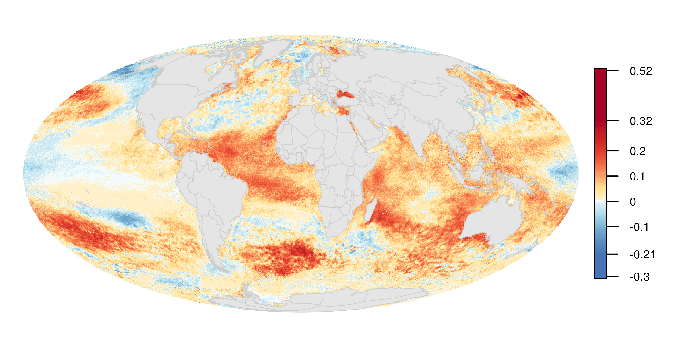
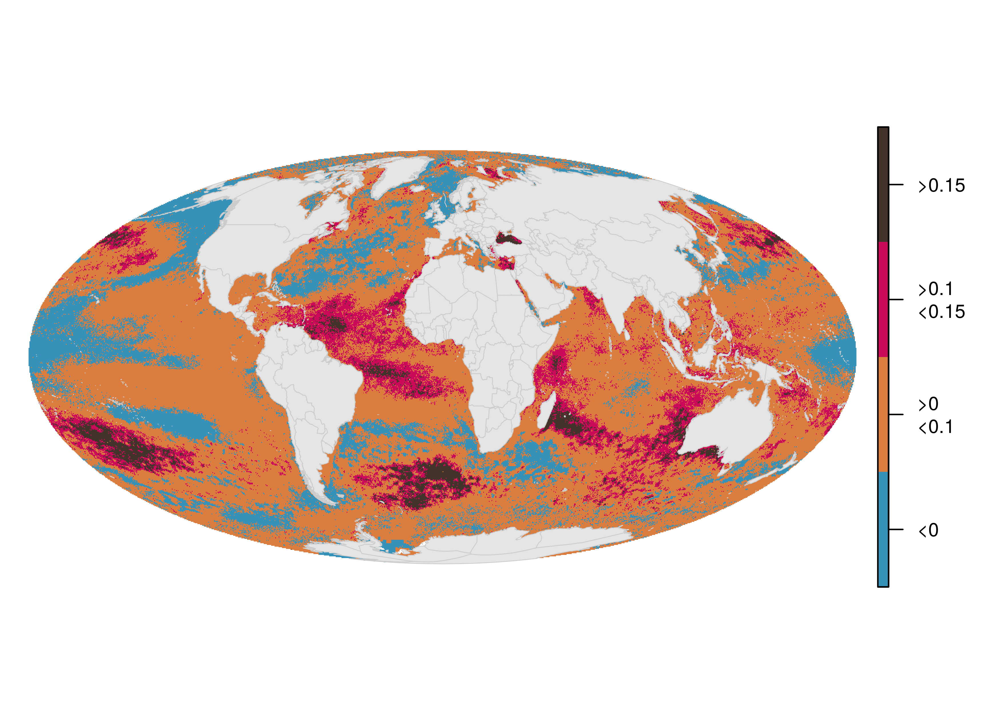
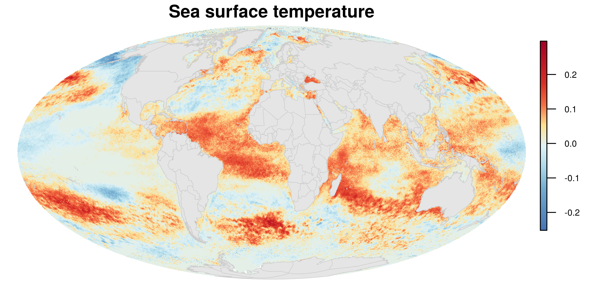
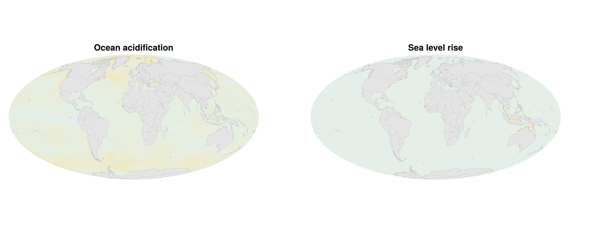
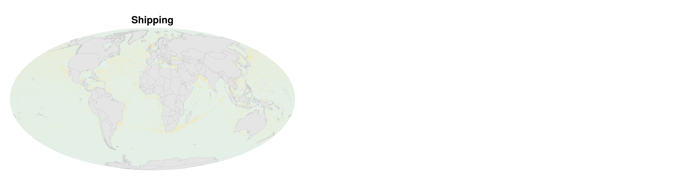
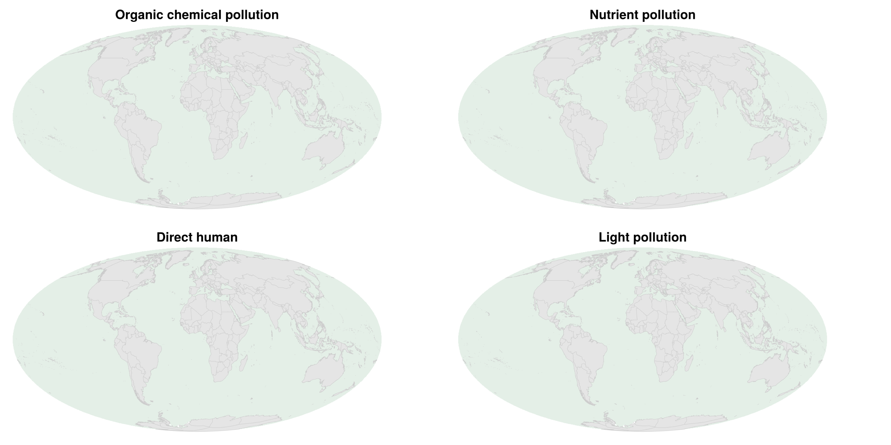
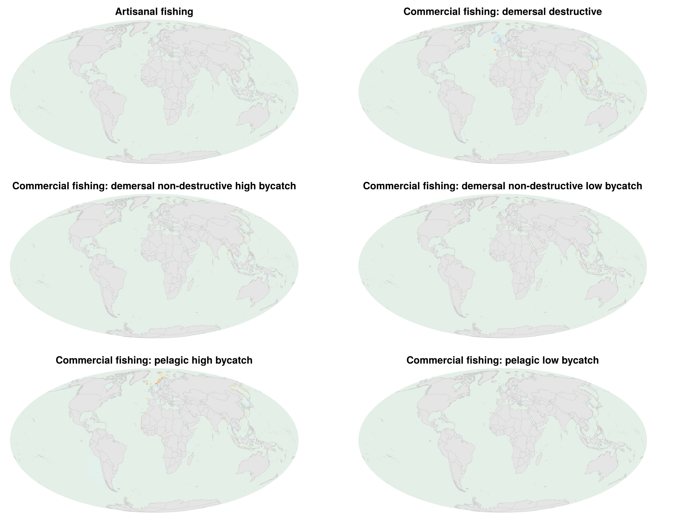
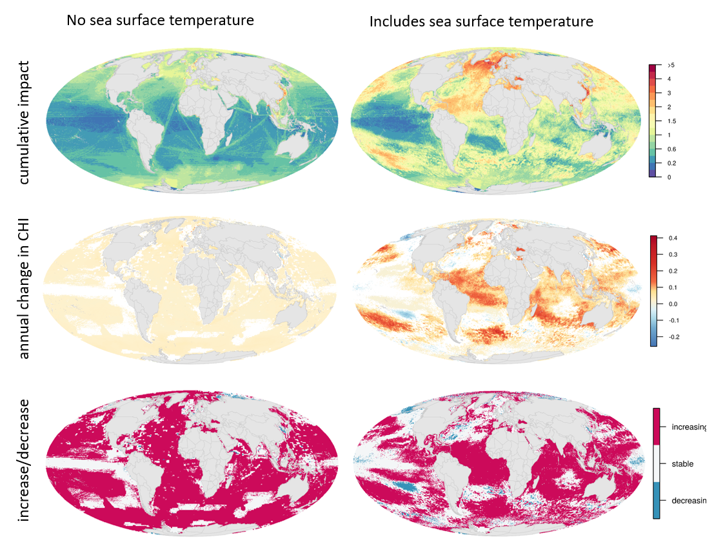

  
```{r, echo = FALSE, message = FALSE, warning = FALSE, error=FALSE, include=FALSE}
library(tidyr)
library(dplyr)
library(raster)
library(RColorBrewer)
library(rgdal)
library(sf)
library(fields)
library(cowplot)
library(ggplot2)
library(here)

source("https://raw.githubusercontent.com/OHI-Science/ohiprep_v2018/master/src/R/spatial_common.R")

regions_shape <- as(regions, "Spatial")
land <- regions_shape[regions_shape$rgn_type %in% c("land", "land-disputed", "land-noeez", "eez-inland"), ]

```


## Fig S1A. Annual change in cumulative human impacts
Annual change in CHI estimated using a linear regression model from 2003 to 2013 for each raster cell.



## Fig S1B. Categories of annual change in cumulative impacts 
Categories of annual change in CHI based on linear model estimates of slope from CHI values from 2003 to 2013.  Areas are identified as decreasing CHI (slope < 0), and increasing CHI when: >0, >0.1, and >0.15.

```{r, eval=FALSE, echo = FALSE, message = FALSE, warning = FALSE, error=FALSE, include=FALSE}

trend <- raster::raster(file.path(dir_M, "git-annex/impact_acceleration/impact/trend/chi_slope.tif"))

# slope = 0.0

m <- c(-Inf, 0, -1,   
       0, 0.1, 1,  
       0.1, 0.15, 2,
       0.15, Inf, 3)
rclmat <- matrix(m, ncol=3, byrow=TRUE)

reclassify(trend, rclmat, 
           filename = file.path(dir_M, 'git-annex/impact_acceleration/paper/figures/trend_categories.tif'), overwrite=TRUE, progress="text")

trend_cats <- raster(file.path(dir_M, 'git-annex/impact_acceleration/paper/figures/trend_categories.tif'))
freq(trend_cats)

# ocean: 416190801
79187232/416190801 #19% decreasing
(46265670+10123175)/416190801 # 0.1 or greater trend
10123175/416190801 # 0.15 or greater trend


```

```{r, eval=FALSE, echo = FALSE, message = FALSE, warning = FALSE, error=FALSE, include=FALSE}

trend_cats <- raster(file.path(dir_M, 'git-annex/impact_acceleration/paper/figures/trend_categories.tif'))
my_breaks <- c(-1, 0, 1, 2, 3)
# blue, light brown , black , red
cols = c( "#3692b8", "#db7d3f", "#cc0a5a", "#42342b")
labels=c("<0", ">0\n<0.1", ">0.1\n<0.15", ">0.15")

legend.shrink <- 0.7
legend.width <- 0.5
png("paper/figures/trend/chi_trend_categories.png", res=500, width=7, height=5, units="in") 
par(mar=c(1, 1, 1, 1))
par(oma=c(0,0,0,0))
plot(trend_cats, col=cols, axes=FALSE, box=FALSE, breaks=my_breaks, legend=FALSE)
# add axis with fields package function:
def_breaks <- c(0, 1, 2, 3, 4)
fields::image.plot(trend_cats, #zlim = c(min(myBreaks), max(myBreaks)), 
           legend.only = TRUE, 
           legend.shrink=legend.shrink,
           legend.width=legend.width,
           col = cols,
           breaks=def_breaks,
           #lab.breaks=labels,
           axis.args = list(cex.axis = 0.8, at=c(0.5, 1.5, 2.5, 3.5), labels=labels))
plot(land, add=TRUE, border="gray80", col="gray90", lwd=0.5)
dev.off()

```




## Fig S1C. Individual impact trends (scaled to SST) 
Impact trends for each of the 14 impacts.  Impacts are separated by major groups: climate change, shipping, land-based, and fishing (commercial and artisanal).  All maps use the same color scale, to describe the relative contribution of each impact to the cumulative impacts.    

```{r, eval=FALSE, echo = FALSE, message = FALSE, warning = FALSE, error=FALSE, include=FALSE}

# all values scaled to sst
global_plot_function <- function(plotRast, cols=cols, title = "", saveFile, scaleFile, include_legend=TRUE){

png(sprintf("paper/figures/trend/impacts/%s.png",  saveFile), 
    res=500, width=7, height=3.3, units="in")  
  par(mar=c(0.1,1,1,1)) # bottom, left, top, and right
  par(oma=c(0,0,0,0))

plot(plotRast, col=cols,  
     breaks=c(-.1, seq(minValue(scaleFile),
                  maxValue(scaleFile), length.out=254)), 
     legend=FALSE, axes=FALSE, box=FALSE)

  title(main=list(title, cex=1.2), line=0)

  plot(land, add=TRUE, border="gray80", col="gray90", lwd=0.5)

  if(include_legend){
par(mfrow=c(1, 1), mar=c(2, 0, 1, 0), new=FALSE)
plot(scaleFile, legend.only=TRUE, legend.shrink=.8, legend.width=.5, col=cols, axis.args = list(cex.axis = 0.6))
}
  dev.off()
}

cols <- rev(colorRampPalette(c("#A50026", "#BE1826", "#D73027", "#F46D43", 
                               "#FEE090", 
                               "#E0F3F8", "#ABD9E9", "#74ADD1", "#5C91C2", "#4575B4"))(254))
#colorRampPalette(c("#74ADD1", "#4575B4"))(3)

## Climate change
sst <- raster(file.path(dir_M, "git-annex/impact_acceleration/impact/trend/impacts/sst_trend.tif"))
oa <- raster(file.path(dir_M, "git-annex/impact_acceleration/impact/trend/impacts/oa_trend.tif"))
slr <- raster(file.path(dir_M, "git-annex/impact_acceleration/impact/trend/impacts/slr_trend.tif"))

global_plot_function(plotRast=sst, cols=cols, saveFile="sst_global", title="Sea surface temperature", include_legend=TRUE, scaleFile=sst)

global_plot_function(plotRast=oa, cols=cols, saveFile="oa_global", title="Ocean acidification", include_legend=FALSE, scaleFile=sst)

global_plot_function(plotRast=slr, cols=cols, saveFile="slr_global", title="Sea level rise", include_legend=FALSE, scaleFile=sst)

## Shipping
shipping <- raster(file.path(dir_M, "git-annex/impact_acceleration/impact/trend/impacts/shipping_trend.tif"))

global_plot_function(plotRast=shipping, cols=cols, saveFile="shipping_global", title="Shipping", include_legend=FALSE, scaleFile=sst)

## Land-based
organic <- raster(file.path(dir_M, "git-annex/impact_acceleration/impact/trend/impacts/organic_trend.tif"))
nutrient <- raster(file.path(dir_M, "git-annex/impact_acceleration/impact/trend/impacts/nutrient_trend.tif"))
human <- raster(file.path(dir_M, "git-annex/impact_acceleration/impact/trend/impacts/direct_human_trend.tif"))
light <- raster(file.path(dir_M, "git-annex/impact_acceleration/impact/trend/impacts/light_trend.tif"))

global_plot_function(plotRast=organic, cols=cols, saveFile="organic_global", title="Organic chemical pollution", include_legend=FALSE, scaleFile=sst)
global_plot_function(plotRast=nutrient, cols=cols, saveFile="nutrient_global", title="Nutrient pollution", include_legend=FALSE, scaleFile=sst)
global_plot_function(plotRast=human, cols=cols, saveFile="human_global", title="Direct human", include_legend=FALSE, scaleFile=sst)
global_plot_function(plotRast=light, cols=cols, saveFile="light_global", title="Light pollution", include_legend=FALSE, scaleFile=sst)

## Fishing
artisanal <- raster(file.path(dir_M, "git-annex/impact_acceleration/impact/trend/impacts/art_fish_trend.tif"))
dd <- raster(file.path(dir_M, "git-annex/impact_acceleration/impact/trend/impacts/dem_dest_trend.tif"))
dnd_hb <- raster(file.path(dir_M, "git-annex/impact_acceleration/impact/trend/impacts/dem_nondest_hb_trend.tif"))
dnd_lb <- raster(file.path(dir_M, "git-annex/impact_acceleration/impact/trend/impacts/dem_nondest_lb_trend.tif"))
pel_hb <- raster(file.path(dir_M, "git-annex/impact_acceleration/impact/trend/impacts/pel_hb_trend.tif"))
pel_lb <- raster(file.path(dir_M, "git-annex/impact_acceleration/impact/trend/impacts/pel_lb_trend.tif"))


global_plot_function(plotRast=artisanal, cols=cols, saveFile="fishing_artisanal_global", title="Artisanal fishing", include_legend=FALSE, scaleFile=sst)
global_plot_function(plotRast=dd, cols=cols, saveFile="dem_dest_global", title="Commercial fishing: demersal destructive", include_legend=FALSE, scaleFile=sst)
global_plot_function(plotRast=dnd_hb, cols=cols, saveFile="dem_nondest_hb_global", title="Commercial fishing: demersal non-destructive high bycatch", include_legend=FALSE, scaleFile=sst)
global_plot_function(plotRast=dnd_lb, cols=cols, saveFile="dem_nondest_lb_global", title="Commercial fishing: demersal non-destructive low bycatch", include_legend=FALSE, scaleFile=sst)
global_plot_function(plotRast=pel_hb, cols=cols, saveFile="pel_hb_global", title="Commercial fishing: pelagic high bycatch", include_legend=FALSE, scaleFile=sst)
global_plot_function(plotRast=pel_lb, cols=cols, saveFile="pel_lb_global", title="Commercial fishing: pelagic low bycatch", include_legend=FALSE, scaleFile=sst)

```

#### Climate Change


```{r, echo = FALSE, message = FALSE, warning = FALSE, error=FALSE, include=FALSE, eval=FALSE}

oa <- ggdraw() + draw_image(here("paper/figures/trend/impacts/oa_global.png"))

slr <- ggdraw() + draw_image(here("paper/figures/trend/impacts/slr_global.png"))

plot_grid(oa, slr, nrow=1, labels=c("", ""))
ggsave("paper/figures/trend/impacts/cc.png", dpi=300, width=8, height=2.2, units=c("in"))

```

#### Shipping
```{r, echo = FALSE, message = FALSE, warning = FALSE, error=FALSE, include=FALSE, eval=FALSE}

shipping <- ggdraw() + draw_image(here("paper/figures/trend/impacts/shipping_global.png"))


plot_grid(shipping, NULL, nrow=1, labels=c("", ""))
ggsave("paper/figures/trend/impacts/shipping.png", dpi=300, width=8, height=2.2, units=c("in"))

```




#### Land-based
```{r, echo = FALSE, message = FALSE, warning = FALSE, error=FALSE, include=FALSE, eval=FALSE}

organic <- ggdraw() + draw_image(here("paper/figures/trend/impacts/organic_global.png"))

nutrient <- ggdraw() + draw_image(here("paper/figures/trend/impacts/nutrient_global.png"))

human <- ggdraw() + draw_image(here("paper/figures/trend/impacts/human_global.png"))

light <- ggdraw() + draw_image(here("paper/figures/trend/impacts/light_global.png"))

plot_grid(organic, nutrient, human, light, nrow=2, labels=c("", "", "", ""))
ggsave("paper/figures/trend/impacts/land_based.png", dpi=300, width=8, height=4.4, units=c("in"))
```


#### Fishing

```{r, echo = FALSE, message = FALSE, warning = FALSE, error=FALSE, include=FALSE, eval=FALSE}

artisanal <- ggdraw() + draw_image(here("paper/figures/trend/impacts/fishing_artisanal_global.png"))
dd <- ggdraw() + draw_image(here("paper/figures/trend/impacts/dem_dest_global.png"))

dnd_hb <- ggdraw() + draw_image(here("paper/figures/trend/impacts/dem_nondest_hb_global.png"))
dnd_lb <- ggdraw() + draw_image(here("paper/figures/trend/impacts/dem_nondest_lb_global.png"))

pel_hb <- ggdraw() + draw_image(here("paper/figures/trend/impacts/pel_hb_global.png"))
pel_lb <- ggdraw() + draw_image(here("paper/figures/trend/impacts/pel_lb_global.png"))

plot_grid(artisanal, dd, dnd_hb, dnd_lb, pel_hb, pel_lb, nrow=3, labels=c("", "", "", "", "", ""))
ggsave("paper/figures/trend/impacts/fishing.png", dpi=300, width=8, height=6.6, units=c("in"))
```


## Fig S1D. SST influence on cumulative impact and trend 
Sea surface temperature was, by far, the largest driver of global (but not coastal) cumulative impacts and annual change in cumulative impacts. Left figures exclude SST and right figures include SST.



```{r, eval=FALSE, echo = FALSE, message = FALSE, warning = FALSE, error=FALSE, include=FALSE}

# create CHI raster without SST
chi <- raster(file.path(dir_M, "git-annex/impact_acceleration/impact/cumulative_impact/chi_2013.tif"))
sst <- raster(file.path(dir_M, "git-annex/impact_acceleration/impact/stressor_impact/sst_2013.tif"))

chi_sst <- stack(chi, sst)
overlay(chi_sst, fun=function(x,y){x - y}, 
                    filename = file.path(dir_M, 'git-annex/impact_acceleration/impact/figures/chi_minus_sst.tif'), overwrite=TRUE, progress="text")

chi_no_sst <- raster(file.path(dir_M, 'git-annex/impact_acceleration/impact/figures/chi_minus_sst.tif'))

```

```{r, eval=FALSE, echo = FALSE, message = FALSE, warning = FALSE, error=FALSE, include=FALSE}

# make plot using CHI - SST raster:

legend.shrink <- 0.7
legend.width <- 0.6

raster_breaks <- function(raster_data, title, title_legend=NULL, myBreaks, cols){
  par(mar=c(1,1,1,1)) # bottom, left, top, and right
  par(oma=c(0,0,0,0))
plot(raster_data, col=cols, axes=FALSE, box=FALSE, breaks=myBreaks, legend=FALSE)
  title(title, line=0)
# add axis with fields package function:
def_breaks <- seq(0, length(myBreaks), length.out=length(myBreaks))
image.plot(raster_data, #zlim = c(min(myBreaks), max(myBreaks)), 
           legend.only = TRUE, 
           legend.shrink=legend.shrink,
           legend.width=legend.width,
           col = cols,
           legend.lab=title_legend,
            breaks=def_breaks,
           lab.breaks=c(0, NA, 0.2, NA, 0.6, NA, 1, NA, 1.5, NA, 2, NA, 3, NA, 4.0, NA, ">5"),
           axis.args = list(cex.axis = 0.6))

plot(land, add=TRUE, border="gray80", col="gray90", lwd=0.5)
#plot(raster_data, col=cols, axes=FALSE, box=FALSE, breaks=myBreaks, legend=FALSE, add=TRUE)
}

my_breaks <- c(-1, 0, 0.2, 0.4, 0.6, 0.8, 1, 1.25, 1.5, 1.75, 2, 2.5, 3, 3.5, 4.0, 5, 100) 
cols = rev(colorRampPalette(brewer.pal(11, 'Spectral'))(length(my_breaks)-1)) #(length(my_breaks)-2))


png("impacts/figures/chi_maps/chi_noSST.png", res=600, width=6, height=3, units="in")  
raster_breaks(raster_data=chi_no_sst,  
              myBreaks=my_breaks, cols=cols, title="")
dev.off()


```

```{r trend_map_noSST, eval=FALSE, echo = FALSE, message = FALSE, warning = FALSE, error=FALSE, include=FALSE}
# create the raster

# chi no_sst
chi_slope <- raster(file.path(dir_M, 'git-annex/impact_acceleration/impact/trend/chi_slope.tif'))
sst_slope <- raster(file.path(dir_M, 'git-annex/impact_acceleration/impact/trend/impacts/sst_trend.tif'))

chi_sst_slope <- stack(chi_slope, sst_slope)
overlay(chi_sst_slope, fun=function(x,y){x - y}, 
                    filename = file.path(dir_M, 'git-annex/impact_acceleration/paper/figures/chi_minus_sst_trend.tif'), overwrite=TRUE, progress="text")
```


```{slope_no_sst_plot, eval=FALSE, echo = FALSE, message = FALSE, warning = FALSE, error=FALSE, include=FALSE}

## plot the raster
slope_noSST <- raster(file.path(dir_M, 'git-annex/impact_acceleration/paper/figures/chi_minus_sst_trend.tif'))
slope <- raster(file.path(dir_M, 'git-annex/impact_acceleration/impact/trend/chi_slope.tif'))
overlay <- raster(file.path(dir_M, "git-annex/impact_acceleration/no_sst/trend/sig_overlay.tif"))

cols <- rev(colorRampPalette(c("#A50026", "#BE1826", "#CA2426", "#D73027", "#E54E35", "#F46D43", 
                               "#FEE090", "#FFF1CC",
                               "#E0F3F8", "#ABD9E9", "#74ADD1", "#5C91C2", "#4575B4"))(254))


png("paper/figures/trend/chi_trend_minus_sst.png", 
    res=500, width=6, height=3, units="in")  
  par(mar=c(1,1,1,1)) # bottom, left, top, and right
  par(oma=c(0,0,0,0))

plot(slope_noSST, col=cols,  
     breaks=c(-.1, seq(minValue(slope),
                  maxValue(slope), length.out=254)), 
     legend=FALSE, axes=FALSE, box=FALSE)

  plot(land, add=TRUE, border="gray80", col="gray90", lwd=0.5)

  plot(overlay, col="#ffffff", add=TRUE, legend=FALSE, box=FALSE)
  dev.off()

```


```{r trend_patterns, eval=FALSE, echo = FALSE, message = FALSE, warning = FALSE, error=FALSE, include=FALSE}

trend_cats <- raster(file.path(dir_M, 'git-annex/impact_acceleration/impact/trend/trend_pattern.tif'))
my_breaks <- c(-2, -1, 0, 2)

cols = c( "#3692b8", "#f4f6f7", "#cc0a5a")
labels=c("decreasing", "stable", "increasing")

legend.shrink <- 0.7
legend.width <- 0.7
png("paper/figures/trend/chi_trend_pattern.png", res=500, width=6, height=3, units="in") 
par(mar=c(1, 1, 1, 1))
par(oma=c(0,0,0,0))
plot(trend_cats, col=cols, axes=FALSE, box=FALSE, breaks=my_breaks, legend=FALSE)
# add axis with fields package function:
def_breaks <- c(0, 1, 2, 3)
fields::image.plot(trend_cats, #zlim = c(min(myBreaks), max(myBreaks)), 
           legend.only = TRUE, 
           legend.shrink=legend.shrink,
           legend.width=legend.width,
           col = cols,
           breaks=def_breaks,
           #lab.breaks=labels,
           axis.args = list(cex.axis = 0.8, at=c(0.5, 1.5, 2.5), labels=labels))
plot(land, add=TRUE, border="gray80", col="gray90", lwd=0.5)
dev.off()


### no SST
trend_cats <- raster(file.path(dir_M, 'git-annex/impact_acceleration/no_sst/trend/trend_pattern.tif'))
my_breaks <- c(-2, -1, 0, 2)

cols = c( "#3692b8", "#f4f6f7", "#cc0a5a")
labels=c("decreasing", "stable", "increasing")

legend.shrink <- 0.7
legend.width <- 0.7
png("paper/figures/trend/chi_trend_no_sst_pattern.png", res=500, width=6, height=3, units="in") 
par(mar=c(1, 1, 1, 1))
par(oma=c(0,0,0,0))
plot(trend_cats, col=cols, axes=FALSE, box=FALSE, breaks=my_breaks, legend=FALSE)
# add axis with fields package function:
def_breaks <- c(0, 1, 2, 3)
fields::image.plot(trend_cats, #zlim = c(min(myBreaks), max(myBreaks)), 
           legend.only = TRUE, 
           legend.shrink=legend.shrink,
           legend.width=legend.width,
           col = cols,
           breaks=def_breaks,
           #lab.breaks=labels,
           axis.args = list(cex.axis = 0.8, at=c(0.5, 1.5, 2.5), labels=labels))
plot(land, add=TRUE, border="gray80", col="gray90", lwd=0.5)
dev.off()

```


```{r, eval=FALSE, echo = FALSE, message = FALSE, warning = FALSE, error=FALSE, include=FALSE}

NOTE: subtract values to see where differences are
```

## Fig S1E. Annual change in impacts for countries excluding SST and SLR 
Annual change in impacts for 3nm offshore area for 220 countries.  Sea surface temperature and sea level rise are not included to better examine the influence of the remaining impacts cumulative impacts.  SST and SLR were the largest drivers of global change, but other impacts were also important. 


```{r 3nm_eez_trend_circleplot, eval=FALSE, echo = FALSE, message = FALSE, warning = FALSE, error=FALSE, include=FALSE}

# UN georegions
un_rgn <- UNgeorgn_nm %>%
  dplyr::select(rgn_id, georegion = r1_label)

# calculate CHI trend for each region
# get impact data
chi <- read.csv("paper/zonal_data_eez/eez_3nm_impacts_trend.csv") %>% 
  filter(!(pressure %in% c("sst", "slr"))) %>%
  group_by(rgn_id, rgn_name) %>%
  summarize(chi = sum(value)) %>%
  left_join(un_rgn)

# get georegion ranks based on mean chi values, and use to rank chi data
rank_georgn <- chi %>%
  group_by(georegion) %>%
  summarize(mean_chi = mean(chi),
            count = length(chi)) %>%
  arrange(mean_chi)

chi$georegion <- factor(chi$georegion, levels=rank_georgn$georegion)


### Organize the chi data and add a few extra variables to help plotting
# Including empty spaces to add a y-axes

rank_rgn <- chi %>%
  arrange(georegion, chi)

# add empty space
empty_bar <- 6
to_add <- data.frame(matrix(NA, empty_bar, ncol(rank_rgn)) )
colnames(to_add) = colnames(rank_rgn)
to_add$rgn_name <- as.character(1:empty_bar)
rank_rgn  <- bind_rows(to_add, rank_rgn)

# modify region names to be shorter
rank_rgn <- rank_rgn %>%
  dplyr::mutate(rgn_name_short = rgn_name, 
         rgn_name_short = gsub("Islands", "Isl", rgn_name_short),
         rgn_name_short = gsub("Island", "Isl", rgn_name_short),
         rgn_name_short = gsub("Democratic", "Dem", rgn_name_short),
         rgn_name_short = gsub("Republic", "Rep", rgn_name_short),
         rgn_name_short = gsub("South", "S", rgn_name_short),
         rgn_name_short = gsub("American", "Am", rgn_name_short),
         rgn_name_short = gsub("the United States", "US", rgn_name_short),
         rgn_name_short = gsub("Territory", "Terr", rgn_name_short),
         rgn_name_short = gsub("Saint", "St", rgn_name_short),
         rgn_name_short = gsub(" and ", " & ", rgn_name_short),
         rgn_name_short = gsub("Republique", "Rep", rgn_name_short),
         rgn_name_short = gsub("Dem Rep of the", "Dem Rep of", rgn_name_short),
         rgn_name_short = gsub("Georgia and the", "Georgia and", rgn_name_short),
         rgn_name_short = gsub("St Vincent and the", "St Vincent and", rgn_name_short),
         rgn_name_short = gsub("Howland Isl & Baker Isl", "Howland & Baker Isl", rgn_name_short),
         rgn_name_short = gsub("Northern", "N", rgn_name_short), 
         rgn_name_short = gsub("Reunion", "Reunion", rgn_name_short))


# some code to orient the country labels
sequence_length = length(unique(rank_rgn$rgn_name))
first_sequence = c(1:(sequence_length%/%2)) 
second_sequence = c((sequence_length%/%2+1):sequence_length) 
first_angles = c(90 - 180/length(first_sequence) * first_sequence)
second_angles = c(-90 - 180/length(second_sequence) * second_sequence)

rank_rgn$angle <- c(first_angles,second_angles)
rank_rgn$hjust <- c(rep(0, length(first_sequence)), 
                       rep(1, length(second_sequence)))

# color for region labels
rank_rgn <- rank_rgn %>%
  mutate(rgn_name = factor(rgn_name, unique(rgn_name))) %>%
  mutate(georegion = factor(georegion, unique(georegion))) %>%
  mutate(color = "black") %>%
  mutate(color = ifelse(is.na(chi), "white", color))


########### marking georegions

# add column to identify when georegion changes
rgn_shift <- rank_rgn %>%
  mutate(georegion = ifelse(is.na(georegion), "tmp", georegion)) %>%
  mutate(georegion = as.factor(georegion)) %>%
  mutate(region_shift = as.numeric(georegion) - lag(as.numeric(georegion)), default=first(as.numeric(georegion)))

rgn_shift <- which(rgn_shift$region_shift > 0)
rgn_shift <- c(1, rgn_shift) -0.5
rgn_shift <- data.frame(rgn_shift_x=rgn_shift,
                        georegion = rank_georgn$georegion,
                        name_x= c(5, 25, 70, 110, 150, 177, 200), # 140
                        name_y=c(0.05, 0.05, 0.05, 0.05, 0.05, 0.05, 0.05))
rgn_shift <- rgn_shift %>%
  mutate(georegion = as.character(georegion)) %>%
  mutate(georegion = ifelse(georegion == "Latin America and the Caribbean", "Latin America\nand\nCaribbean",
                            georegion))

# get impact data
impacts <- read.csv("paper/zonal_data_eez/eez_3nm_impacts_trend.csv") %>%
  filter(!(pressure %in% c("sst", "slr"))) %>%
  left_join(un_rgn)

# ## add some blanks to separate groups
to_add <-  data.frame( matrix(NA, empty_bar*nlevels(as.factor(impacts$pressure)), ncol(impacts)) )
colnames(to_add) <- colnames(impacts)
to_add$pressure <- rep(levels(as.factor(impacts$pressure)), each=empty_bar)
to_add$value <-  0
to_add$rgn_name <- as.character(rep(1:empty_bar, nlevels(as.factor(impacts$pressure)))) 

impacts <- bind_rows(to_add, impacts, to_add)


## rank of pressure categories
impacts %>%
  group_by(pressure) %>%
  summarize(mean = mean(value)) %>%
  arrange(mean)

pressure_name <- data.frame(pressure = c("sst", "slr", "oa", 
                                                  "shipping",
                                                  "light", "nutrient", "direct_human", "organic",
                                                  "pel_hb", "dem_nondest_hb","pel_lb", 
                                                  "dem_nondest_lb", "dem_dest", "art_fish"),
                            pressure_name = c("sst", "slr", "oa",
                                              "shipping", "light pollution", 
                                              "nutrient pollution", "direct human", "organic pollution",  
                                              "comm fish: pel hb", "comm fish: dem nondest hb", "comm fish: pel lb", 
                                              "comm fish: dem nondest lb", "comm fish: dem dest", "artisanal fishing"))

impacts <- impacts %>%
  left_join(pressure_name, by = "pressure")

impacts$pressure_name <- factor(impacts$pressure_name, levels=rev(pressure_name$pressure_name))
impacts$rgn_name <- factor(impacts$rgn_name, levels=unique(rank_rgn$rgn_name))


library(beyonce)

myPalette <- c(beyonce_palette(18, 15, type=c("continuous"))[1:6],
               beyonce_palette(18, 25, type=c("continuous"))[15:18],
               beyonce_palette(18, 15, type=c("continuous"))[8],
               beyonce_palette(18, 20, type=c("continuous"))[16:18])
               

## some theme stuff to make the circle plot look nice

circle_theme <- theme(axis.line=element_blank(),
      axis.text.y=element_blank(),
      axis.ticks=element_blank(),
      axis.title.x=element_blank(),
      axis.title.y=element_blank(),
      legend.position="none",
      panel.background=element_blank(),
      panel.border=element_blank(),
      panel.grid.major=element_blank(),
      panel.grid.minor=element_blank(),
      plot.background=element_blank(),
      axis.text.x = element_blank())

# circle plot
# https://www.r-graph-gallery.com/299-circular-stacked-barplot/
p <- ggplot(data=impacts, aes(x=rgn_name, y=value, fill=pressure_name)) + 
  geom_bar(stat="identity") +
  geom_errorbar(aes(x = 1, ymin = -0.15, ymax=0.08), alpha=0)  +
  geom_text(data=rank_rgn, aes(x=rgn_name, y=0.08, label=rgn_name_short, angle=angle, hjust=hjust, color=color), inherit.aes = FALSE) +
  geom_segment(x = 5, y = 0, xend = dim(rank_rgn)[1]+1, yend = 0, colour = "black", alpha=1, size=0.5) +
  geom_segment(x = 7, y = -0.05, xend = dim(rank_rgn)[1]-1, yend = -0.05, colour = "gray", alpha=1, size=0.5) +
  annotate("text", x = c(3,3,3,3), y = c(-0.05, 0, 0.05, 0.075), label = c(-0.05, 0, 0.05, 0.075), color="darkgrey", angle=-8, size=4) +
  scale_colour_identity() +
  scale_fill_manual(values=myPalette) +
  coord_polar() +
  geom_segment(data = rgn_shift, aes(x=rgn_shift_x, xend=rgn_shift_x, y=rep(-0.05, dim(rgn_shift)[1]), yend=rep(0.1, dim(rgn_shift)[1])), colour="gray", size=0.5, inherit.aes=FALSE) +
geom_text(data=rgn_shift, aes(x=name_x, y=name_y, label=georegion), inherit.aes=FALSE, size=5) +
  #geom_point(data=chi, aes(y=chi, x=rgn_name), fill="black", shape="|", size=2.5) +
  circle_theme

p
ggsave('paper/figures/trend/eez_3nm_trend_no_sst_slr_circleplot.jpg', height=18, width=18, units=c("in"))

ggdraw() + 
  draw_image(here("paper/figures/trend/eez_3nm_trend_no_sst_slr_circleplot.jpg"), 0, 0, 1, 1) +
 draw_image(here("paper/figures/trend/trend_circleplot_legend_no_sst_slr.png"), scale=0.35, x=.34, y=-0.25)

ggsave("paper/figures/trend/trend_circle_no_sst_slr_legend.png", dpi=300, width=30, height=18, units=c("in"))

```


## Fig S1F. Country annual change in cumulative impacts vs. cumulative impacts without SST and SLR 
Comparison of annual change in cumulative impacts when sea surface temperature and sea level rise are included vs. excluded.  Most countries have increasing cumulative impacts even when sea surface temperature and sea level rise are excluded, but the magnitude of change is much smaller.  Red solid line indicates 1:1 relationship.

```{r, echo = FALSE, message = FALSE, warning = FALSE, error=FALSE}

all <- read.csv(here("paper/zonal_data_eez/eez_3nm_impacts_trend.csv")) 

no_cc <- all %>%
  filter(!(pressure %in% c("sst", "slr"))) %>%
  group_by(rgn_id, rgn_name) %>%
  summarize(chi_trend_no_cc = sum(value))

chi <- read.csv(here("paper/zonal_data_eez/eez_chi_3nm_trend.csv"))
compare <- left_join(chi, no_cc)

ggplot(compare, aes(y=chi_trend_no_cc, x=value)) +
  geom_point() +
  ylab("annual change in chi, no sst or slr") +
  xlab("annual change in chi") +
  geom_abline(slope=1, intercept=0, color="red")

```