  
```{r, echo = FALSE, message = FALSE, warning = FALSE, error=FALSE, include=FALSE}
library(tidyr)
library(dplyr)
library(raster)
library(RColorBrewer)
library(rgdal)
library(sf)
library(fields)
library(cowplot)
library(ggplot2)
library(here)

source("https://raw.githubusercontent.com/OHI-Science/ohiprep_v2018/gh-pages/src/R/spatial_common.R")

regions_shape <- as(regions, "Spatial")
land <- regions_shape[regions_shape$rgn_type %in% c("land", "land-disputed", "land-noeez", "eez-inland"), ]

```


## Fig 1. CHI from 2008 to 2013
Cumulative human impact maps from 2003 to 2013.

```{r chi_map, eval=FALSE, echo = FALSE, message = FALSE, warning = FALSE, error=FALSE, include=FALSE}

## function to make plots

legend.shrink <- 0.7
legend.width <- 0.7


raster_breaks <- function(raster_data, title, title_legend=NULL, 
                          color_breaks=my_color_breaks, cols=my_cols,
                          legend_break_labels=my_legend_break_labels, 
                          legend_break_locations=my_legend_break_locations){
  par(mar=c(1,1,1,1)) # bottom, left, top, and right
  par(oma=c(0,0,0,0))
plot(raster_data, col=cols, axes=FALSE, box=FALSE, breaks=color_breaks, legend=FALSE)
  title(title, line=0)
# add axis with fields package function:
break_locations <- seq(0, length(color_breaks), length.out=length(color_breaks))
fields::image.plot(raster_data, #zlim = c(min(myBreaks), max(myBreaks)), 
           legend.only = TRUE, 
           legend.shrink=legend.shrink,
           legend.width=legend.width,
           col = cols,
           #legend.lab=title_legend,
           breaks=break_locations,
           axis.args=list(cex.axis=0.6, at=legend_break_locations, labels=legend_break_labels))

plot(land, add=TRUE, border="gray80", col="gray90", lwd=0.5)
}

my_color_breaks <- c(-1, 0, 0.2, 0.4, 0.6, 0.8, 1, 1.25, 1.5, 1.75, 2, 2.5, 3, 3.5, 4.0, 5, 100)
my_cols = rev(colorRampPalette(brewer.pal(11, 'Spectral'))(length(my_color_breaks)-1)) 


break_locations <- seq(0, length(my_color_breaks), length.out=length(my_color_breaks)) # calculated in fucntion, but needed for below
my_legend_break_labels <- c(0, 0.2, 0.6, 1, 1.5, 2, 3, 4.0, ">5")
my_legend_break_locations <- break_locations[seq(1, length(break_locations), 2)]


for(year in 2003:2013){ # year = 2013
png(here(sprintf("paper/figures/chi_maps/year_labels/chi_%s.png", year)), res=500, width=6, height=3, units="in")  
p_rast <- raster(file.path(dir_M, sprintf("git-annex/impact_acceleration/impact/cumulative_impact/chi_%s.tif", year)))
raster_breaks(raster_data=p_rast,  title=year, 
              cols=my_cols, color_breaks = my_color_breaks,
              legend_break_labels = my_legend_break_labels,
              legend_break_locations = my_legend_break_locations)
dev.off()
}


```

### Gif image


### Yearly images
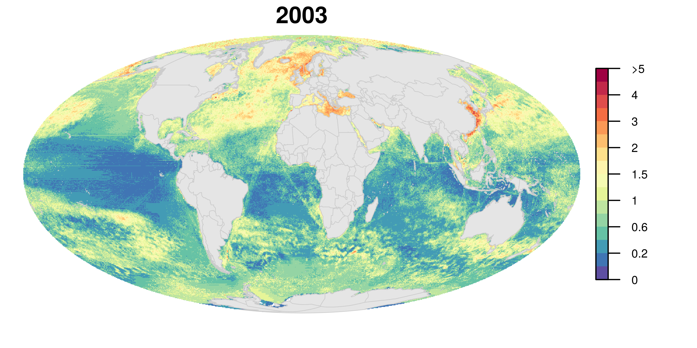

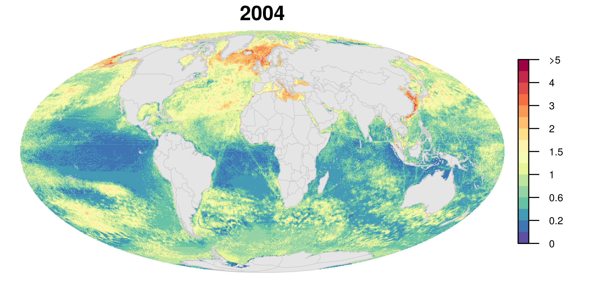

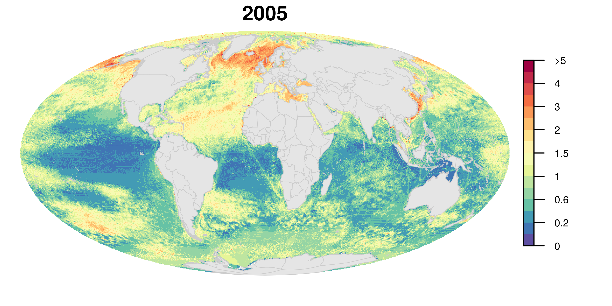

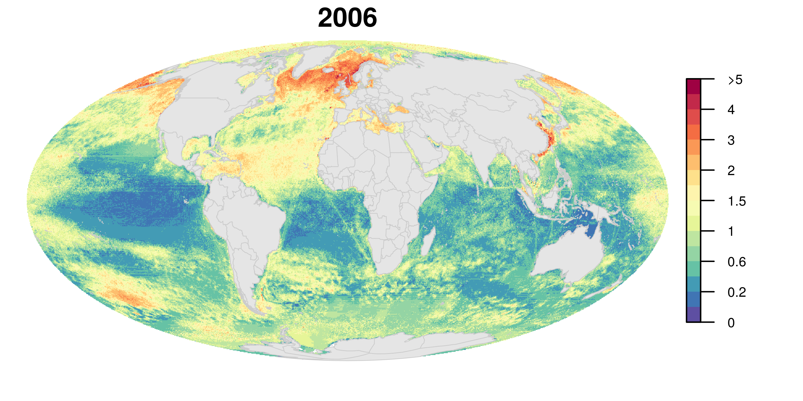

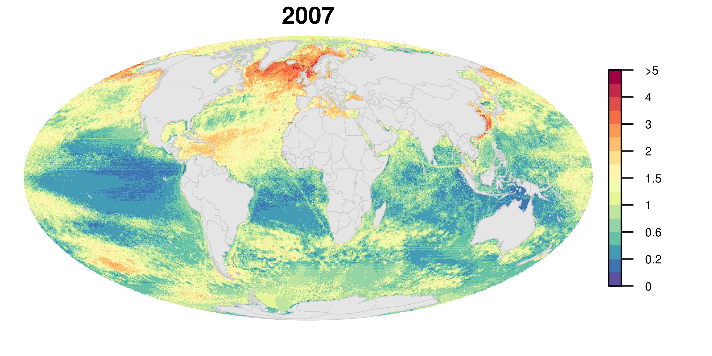

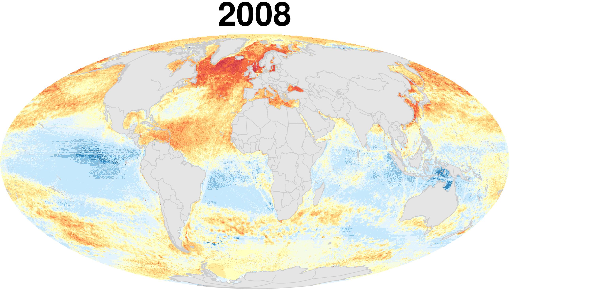

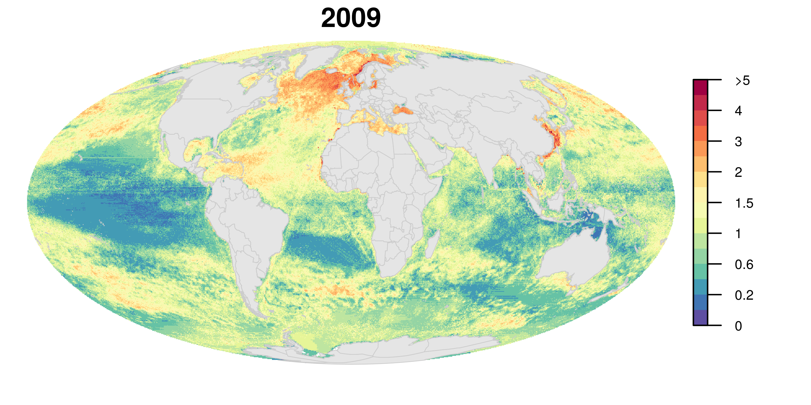

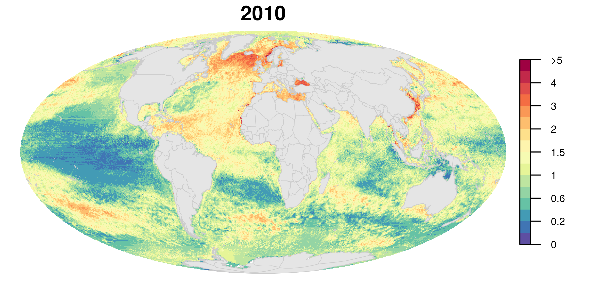

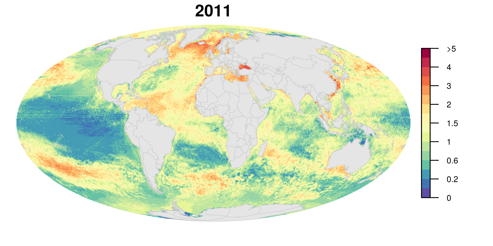

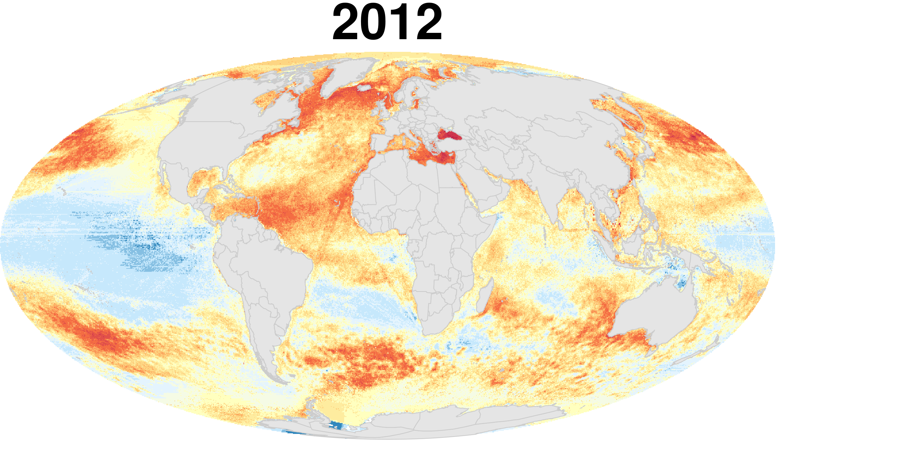
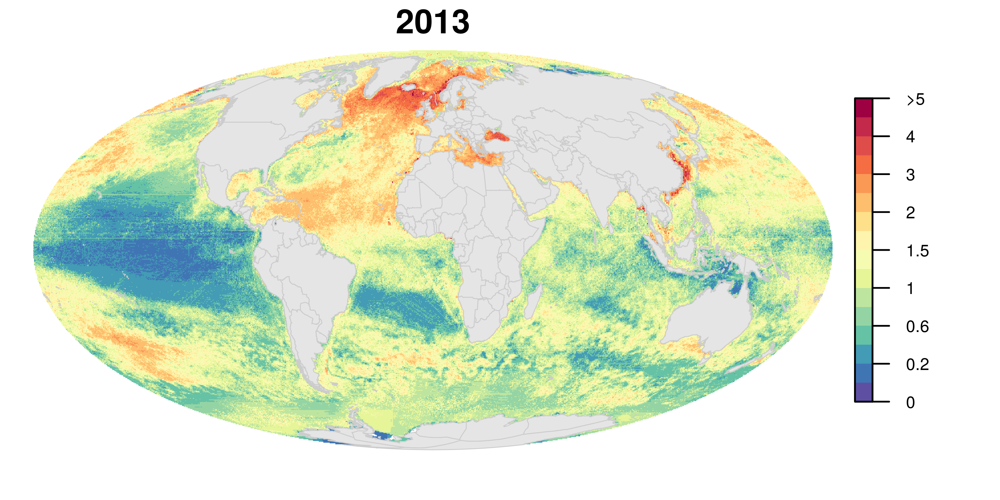


```{r, echo = FALSE, message = FALSE, warning = FALSE, error=FALSE}
#install.packages("magick")
library(magick)

chis <- list.files(path = here("paper/figures/chi_maps/year_labels"), pattern = "*.png", full.names = TRUE) 

  chis         %>% 
  image_read %>% # reads each image file
  image_join() %>% # joins image
  image_animate(fps=1) %>% # animates, can opt for number of loops
  image_write(here("paper/figures/chi_maps/year_labels/merged_chi.gif"))
  
```  
  
## Fig 2. Individual impacts
Global maps of the 14 impacts from 2013.  Impacts are separated by major groups: climate change, shipping, land-based, and fishing (commercial and artisanal).  Color scales are independent of one another so relative spatial variation can be visualized.    

```{r, eval=FALSE, echo = FALSE, message = FALSE, warning = FALSE, error=FALSE, include=FALSE}


# function all values ind_scale
global_plot_ind_scale_function <- function(plotRast, cols=cols, title = "", saveFile, include_legend=TRUE){

png(sprintf("paper/figures/impacts/global/%s.png",  saveFile), 
    res=500, width=7, height=3.3, units="in")  
  par(mar=c(0.1,1,1,1)) # bottom, left, top, and right
  par(oma=c(0,0,0,0))

plot(plotRast, col=cols, legend=FALSE, axes=FALSE, box=FALSE)

  title(main=list(title, cex=1.2), line=0)

  plot(land, add=TRUE, border="gray80", col="gray90", lwd=0.5)

  if(include_legend){
par(mfrow=c(1, 1), mar=c(2, 0, 1, 0), new=FALSE)
plot(plotRast, legend.only=TRUE, legend.shrink=.8, legend.width=.5, col=cols, axis.args = list(cex.axis = 0.6))
}
  dev.off()
}


# labels
pressure_name <- data.frame(pressure = c("sst", "slr", "oa", 
                                                  "shipping",
                                                  "light", "nutrient", "direct_human", "organic",
                                                  "pel_hb", "dem_nondest_hb","pel_lb", 
                                                  "dem_nondest_lb", "dem_dest", "art_fish"),
                            pressure_name = c("sst", "slr", "oa",
                                              "shipping", "light pollution", 
                                              "nutrient pollution", "direct human", "organic pollution",  
                                              "comm fish: pel hb", "comm fish: dem nondest hb", "comm fish: pel lb", 
                                              "comm fish: dem nondest lb", "comm fish: dem dest", "artisanal fishing"))


my_cols = brewer.pal(11, 'Spectral')[1:10] 
my_cols = rev(colorRampPalette(my_cols)(255)) 
my_cols[1] <- "#3288BD66"

impact_files <- list.files(file.path(dir_M, "git-annex/impact_acceleration/impact/stressor_impact"), pattern="2013", full=TRUE)

for(impact_file in impact_files){ # impact_file = impact_files[1]
saveName <-   gsub(".tif", "", basename(impact_file))
pretitleName <- gsub("_2013", "", saveName)
titleName <- as.character(pressure_name$pressure_name[pressure_name$pressure == pretitleName]) 

global_plot_ind_scale_function(plotRast=raster(impact_file), cols=my_cols, saveFile=saveName, title=titleName, include_legend=TRUE)

}

```


#### Climate Change
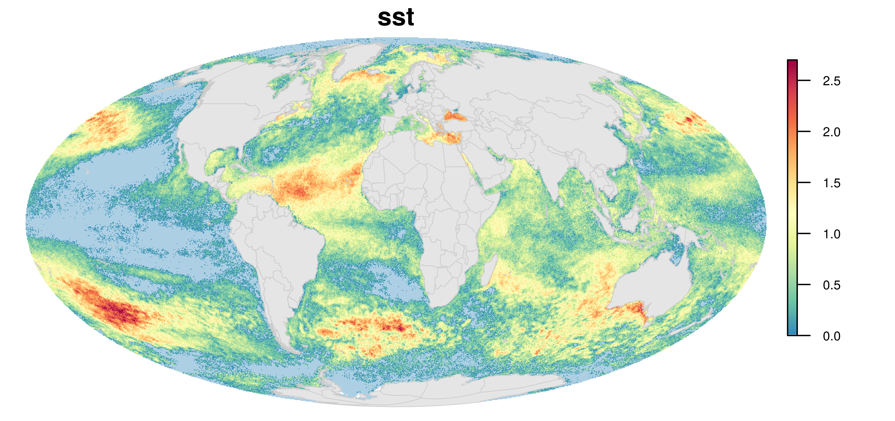
```{r, echo = FALSE, message = FALSE, warning = FALSE, error=FALSE, include=FALSE}

oa <- ggdraw() + draw_image(here("paper/figures/impacts/global/oa_2013.png"))

slr <- ggdraw() + draw_image(here("paper/figures/impacts/global/slr_2013.png"))

plot_grid(oa, slr, nrow=1, labels=c("", ""))
ggsave(here("paper/figures/impacts/global/cc.png"), dpi=300, width=8, height=2.2, units=c("in"))

```

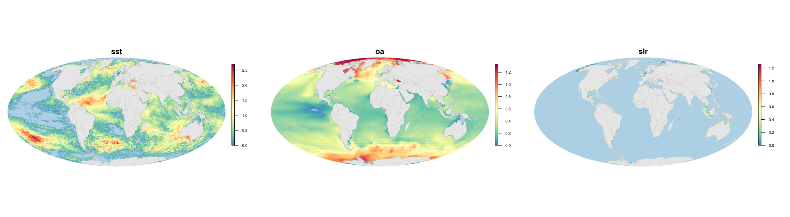

#### Shipping
```{r, echo = FALSE, message = FALSE, warning = FALSE, error=FALSE, include=FALSE}

shipping <- ggdraw() + draw_image(here("paper/figures/impacts/global/shipping_2013.png"))


plot_grid(shipping, NULL, nrow=1, labels=c("", ""))
ggsave(here("paper/figures/impacts/global/shipping.png"), dpi=300, width=8, height=2.2, units=c("in"))

```


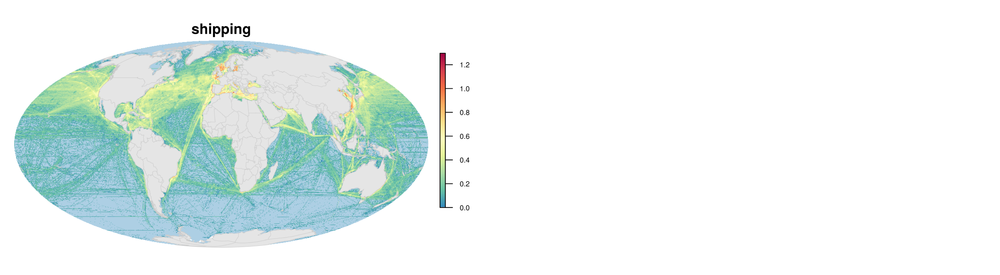

#### Land-based
```{r, echo = FALSE, message = FALSE, warning = FALSE, error=FALSE, include=FALSE}

organic <- ggdraw() + draw_image(here("paper/figures/impacts/global/organic_2013.png"))

nutrient <- ggdraw() + draw_image(here("paper/figures/impacts/global/nutrient_2013.png"))

human <- ggdraw() + draw_image(here("paper/figures/impacts/global/direct_human_2013.png"))

light <- ggdraw() + draw_image(here("paper/figures/impacts/global/light_2013.png"))

plot_grid(organic, nutrient, human, light, nrow=2, labels=c("", "", "", ""))
ggsave(here("paper/figures/impacts/global/land_based.png"), dpi=300, width=8, height=4.4, units=c("in"))
```
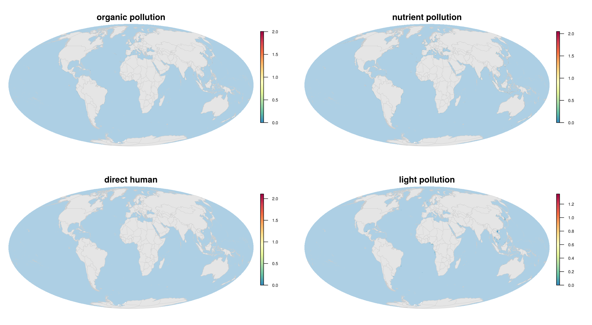

#### Fishing

```{r, echo = FALSE, message = FALSE, warning = FALSE, error=FALSE, include=FALSE}

artisanal <- ggdraw() + draw_image(here("paper/figures/impacts/global/art_fish_2013.png"))
dd <- ggdraw() + draw_image(here("paper/figures/impacts/global/dem_dest_2013.png"))

dnd_hb <- ggdraw() + draw_image(here("paper/figures/impacts/global/dem_nondest_hb_2013.png"))
dnd_lb <- ggdraw() + draw_image(here("paper/figures/impacts/global/dem_nondest_lb_2013.png"))

pel_hb <- ggdraw() + draw_image(here("paper/figures/impacts/global/pel_hb_2013.png"))
pel_lb <- ggdraw() + draw_image(here("paper/figures/impacts/global/pel_lb_2013.png"))

plot_grid(artisanal, dd, dnd_hb, dnd_lb, pel_hb, pel_lb, nrow=3, labels=c("", "", "", "", "", ""))
ggsave(here("paper/figures/impacts/global/fishing.png"), dpi=300, width=8, height=6.6, units=c("in"))
```
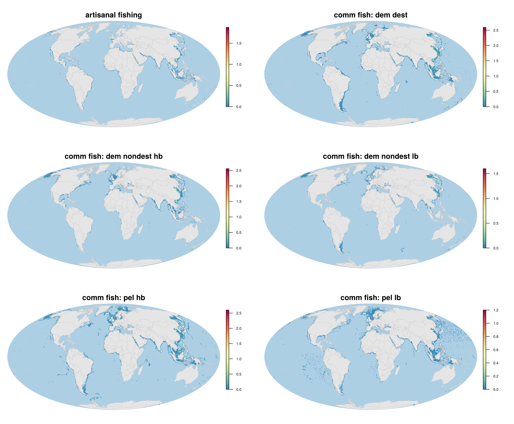


## Fig 3. Individual impact trends
Global maps of the change in impact from 2003 to 2013 for the 14 impacts.  Impacts are separated by major groups: climate change, shipping, land-based, and fishing (commercial and artisanal).  Color scales are independent of one another so relative spatial variation can be visualized.    

```{r, eval=FALSE, echo = FALSE, message = FALSE, warning = FALSE, error=FALSE, include=FALSE}

# function all values ind_scale
global_plot_trend_ind_scale_function <- function(plotRast, cols=cols, title = "", saveFile, include_legend=TRUE){

png(sprintf("paper/figures/trend/impacts/ind_scale/%s.png",  saveFile), 
    res=500, width=7, height=3.3, units="in")  
  par(mar=c(0.1,1,1,1)) # bottom, left, top, and right
  par(oma=c(0,0,0,0))

scaleValue <- max(abs(minValue(plotRast)), abs(maxValue(plotRast)))  

plot(plotRast, col=cols, 
          breaks=seq(-scaleValue, scaleValue, length.out=255),
     legend=FALSE, axes=FALSE, box=FALSE)

  title(main=list(title, cex=1.2), line=0)

  plot(land, add=TRUE, border="gray80", col="gray90", lwd=0.5)

  if(include_legend){
par(mfrow=c(1, 1), mar=c(2, 0, 1, 0), new=FALSE)
plot(plotRast,  breaks=seq(-scaleValue, scaleValue, length.out=255),
     legend.only=TRUE, legend.shrink=.8, legend.width=.5, col=cols, axis.args = list(cex.axis = 0.6,
                                                                    at= c(-scaleValue, 0, scaleValue),
                                                                  labels=c(round(-scaleValue, 2), 0, round(scaleValue, 2))))
}
  dev.off()
}


# labels
pressure_name <- data.frame(pressure = c("sst", "slr", "oa", 
                                                  "shipping",
                                                  "light", "nutrient", "direct_human", "organic",
                                                  "pel_hb", "dem_nondest_hb","pel_lb", 
                                                  "dem_nondest_lb", "dem_dest", "art_fish"),
                            pressure_name = c("sst", "slr", "oa",
                                              "shipping", "light pollution", 
                                              "nutrient pollution", "direct human", "organic pollution",  
                                              "comm fish: pel hb", "comm fish: dem nondest hb", "comm fish: pel lb", 
                                              "comm fish: dem nondest lb", "comm fish: dem dest", "artisanal fishing"))

my_cols <- rev(colorRampPalette(c("#A50026", "#BE1826", "#D73027", "#F46D43",  
                               "#FEE090", "#F5FBFC", 
                               "#E0F3F8", "#ABD9E9", "#74ADD1", "#5C91C2", "#4575B4"))(254))


trend_files <- list.files(file.path(dir_M, "git-annex/impact_acceleration/impact/trend/impacts"), pattern="trend", full=TRUE)

for(trend_file in trend_files){ # trend_file = trend_files[1]
saveName <-   gsub(".tif", "", basename(trend_file))
pretitleName <- gsub("_trend", "", saveName)
titleName <- as.character(pressure_name$pressure_name[pressure_name$pressure == pretitleName]) 

global_plot_trend_ind_scale_function(plotRast=raster(trend_file), cols=my_cols, saveFile=saveName, title=titleName, include_legend=TRUE)

}

```

#### Climate Change
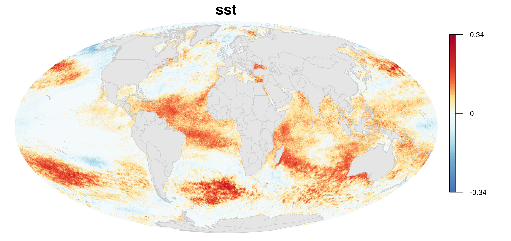
```{r, echo = FALSE, message = FALSE, warning = FALSE, error=FALSE, include=FALSE}

oa <- ggdraw() + draw_image(here("paper/figures/trend/impacts/ind_scale/oa_trend.png"))

slr <- ggdraw() + draw_image(here("paper/figures/trend/impacts/ind_scale/slr_trend.png"))

plot_grid(oa, slr, nrow=1, labels=c("", ""))
ggsave(here("paper/figures/trend/impacts/ind_scale/cc.png"), dpi=300, width=8, height=2.2, units=c("in"))

```

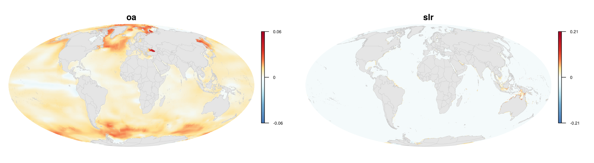

#### Shipping
```{r, echo = FALSE, message = FALSE, warning = FALSE, error=FALSE, include=FALSE}

shipping <- ggdraw() + draw_image(here("paper/figures/trend/impacts/ind_scale/shipping_trend.png"))


plot_grid(shipping, NULL, nrow=1, labels=c("", ""))
ggsave(here("paper/figures/trend/impacts/ind_scale/shipping.png"), dpi=300, width=8, height=2.2, units=c("in"))

```


#### Land-based
```{r, echo = FALSE, message = FALSE, warning = FALSE, error=FALSE, include=FALSE}

organic <- ggdraw() + draw_image(here("paper/figures/trend/impacts/ind_scale/organic_trend.png"))

nutrient <- ggdraw() + draw_image(here("paper/figures/trend/impacts/ind_scale/nutrient_trend.png"))

human <- ggdraw() + draw_image(here("paper/figures/trend/impacts/ind_scale/direct_human_trend.png"))

light <- ggdraw() + draw_image(here("paper/figures/trend/impacts/ind_scale/light_trend.png"))

plot_grid(organic, nutrient, human, light, nrow=2, labels=c("", "", "", ""))
ggsave(here("paper/figures/trend/impacts/ind_scale/land_based.png"), dpi=300, width=8, height=4.4, units=c("in"))
```
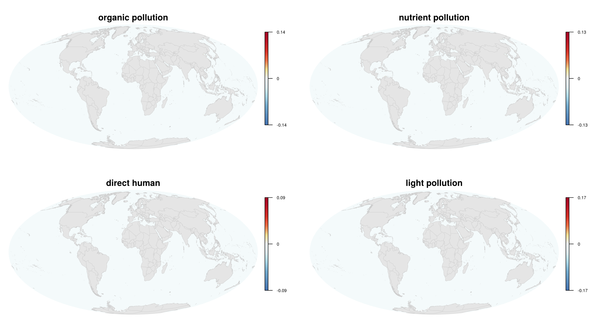

#### Fishing

```{r, echo = FALSE, message = FALSE, warning = FALSE, error=FALSE, include=FALSE}

artisanal <- ggdraw() + draw_image(here("paper/figures/trend/impacts/ind_scale/art_fish_trend.png"))
dd <- ggdraw() + draw_image(here("paper/figures/trend/impacts/ind_scale/dem_dest_trend.png"))

dnd_hb <- ggdraw() + draw_image(here("paper/figures/trend/impacts/ind_scale/dem_nondest_hb_trend.png"))
dnd_lb <- ggdraw() + draw_image(here("paper/figures/trend/impacts/ind_scale/dem_nondest_lb_trend.png"))

pel_hb <- ggdraw() + draw_image(here("paper/figures/trend/impacts/ind_scale/pel_hb_trend.png"))
pel_lb <- ggdraw() + draw_image(here("paper/figures/trend/impacts/ind_scale/pel_lb_trend.png"))

plot_grid(artisanal, dd, dnd_hb, dnd_lb, pel_hb, pel_lb, nrow=3, labels=c("", "", "", "", "", ""))
ggsave(here("paper/figures/trend/impacts/ind_scale/fishing.png"), dpi=300, width=8, height=6.6, units=c("in"))
```
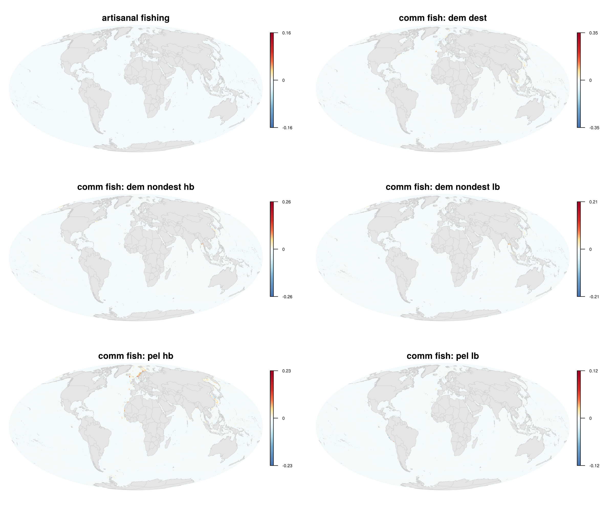
