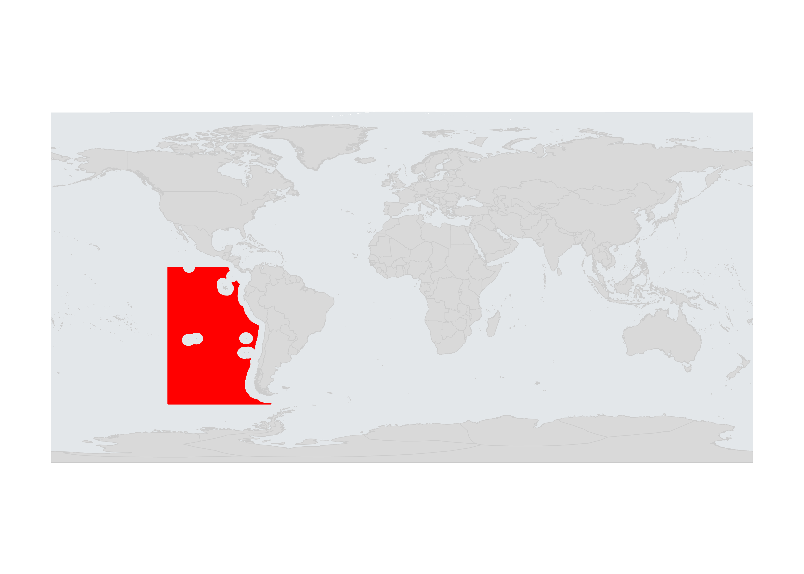
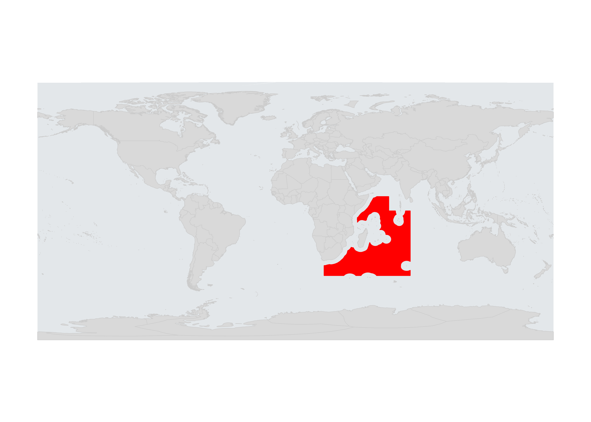

# Some setup
```{r, echo = FALSE, message = FALSE, warning = FALSE, error=FALSE, include=FALSE}

#libraries
library(tidyr)
library(dplyr)
library(raster)
library(RColorBrewer)
library(rgdal)
library(sf)
library(fields)
library(cowplot)
library(ggplot2)
library(here)

source("https://raw.githubusercontent.com/OHI-Science/ohiprep_v2018/gh-pages/src/R/spatial_common.R")

# check areas...look good!
plot(st_area(regions)/1000000, regions$area_km2)

regions_mol <- as(regions, "Spatial")

regions_shape <- spTransform(regions_mol, CRS("+init=epsg:4326"))
land_wgs <- regions_shape[regions_shape$rgn_type %in% c("land", "land-disputed", "land-noeez", "eez-inland"), ]
eez_wgs <- regions_shape[regions_shape$rgn_type %in% c("eez"), ]


pressure_name <- data.frame(pressure = c("chi", "sst", "slr", "oa", 
                                                  "shipping",
                                                  "light", "nutrient", "direct_human", "organic",
                                                  "pel_hb", "dem_nondest_hb","pel_lb", 
                                                  "dem_nondest_lb", "dem_dest", "art_fish"),
                            pressure_name = c("cumulative impact", "sea surface temp", "sea level rise", "ocean acidification",
                                              "shipping", "light pollution", 
                                              "nutrient pollution", "direct human", "organic pollution",  
                                              "pelegic high bycatch", "demersal nondest high bycatch", "pelagic low bycatch", 
                                              "demersal nondest low bycatch", "demersal destructive", "artisanal fishing"))


```


Isolate cpps and wio regions from the provided data. 
```{r, echo = FALSE, message = FALSE, warning = FALSE, eval=FALSE}
## Get the region maps from gdb file
## need to load this for subsequent analyses

fgdb <- "projects/abnj/spatial/CPPS_NC_Pilot_Regions.gdb"

# List all feature classes in a file geodatabase
subset(ogrDrivers(), grepl("GDB", name))
fc_list <- ogrListLayers(fgdb)
print(fc_list)

# Read the feature class 
cpps <- readOGR(dsn=fgdb, layer="cpps")
cpps <- cpps[cpps$type == "ABNJ", ]


wio <- readOGR(dsn=fgdb, layer="wio_pilot")
wio <- wio[wio$type == "ABNJ", ]
wio <- wio[wio$OBJECTID == "1", ]

```


Save a buffered area around the cpps and wio regions for plotting purposes.
```{r}
cpps_extent <- extent(cpps)+20
wio_extent <- extent(wio)+20

```


# Spatial data files
Make a mollweide shapefile version of regions for extracting raster impact data.
```{r}
cpps_mol <- spTransform(cpps, CRS(proj4string(regions_mol)))
cpps_mol <- cpps_mol[cpps_mol$type == "ABNJ", ]
writeOGR(cpps_mol, "projects/abnj/spatial", "cpps_mol", driver="ESRI Shapefile")

wio_mol <- spTransform(wio, CRS(proj4string(regions_mol)))
wio_mol <- wio_mol[wio_mol$type == "ABNJ", ]
writeOGR(wio_mol, "projects/abnj/spatial", "wio_mol", driver="ESRI Shapefile")

## Make a mollweide map, probably not necessary
# rgn_area <- readOGR("projects/abnj/spatial", "cpps_mol")
# 
# png("projects/abnj/figures/global_cpps.png", res=500, width=7, height=4, units="in")
# par(mar=c(2,2,2,2)) # bottom, left, top, and right
# par(oma=c(0,0,0,0))
# 
# plot(regions_shape, col='#e3e7ea', border=NA)
# plot(land, col='gray85', border='grey80', add=TRUE, lwd=0.5)
# plot(rgn_area, col="red", border="red", add=TRUE)
# dev.off()

```


Make lat/long raster of regions to mask relevant sections of the impact raster data.
```{r}

chi <- raster(file.path(dir_M, "git-annex/impact_acceleration/paper/figures/chi_lat_long_2013.tif")) #used for extent, etc.


raster_crop <- function(extent_file, rgn_file, fileName){
rgn_crop <- crop(chi, extent_file)
rasterize(rgn_file, rgn_crop, progress="text", 
                         filename=file.path(dir_M, sprintf("git-annex/impact_acceleration/projects/abnj/spatial/%s_latlong_raster.tif", fileName)), overwrite=TRUE)
}

raster_crop(cpps_extent, cpps, "cpps")
raster_crop(wio_extent, wio, "wio")

test <- raster(file.path(dir_M, "git-annex/impact_acceleration/projects/abnj/spatial/wio_latlong_raster.tif"))
plot(test)

```


## Create a map to describe location of cpps and wio regions

```{r}

## make map of regions

rgn_map <- function(rgn, filename){
png(sprintf("projects/abnj/figures/latlong_global_%s.png", filename), res=500, width=7, height=5, units="in")
par(mar=c(1,1,1,1)) # bottom, left, top, and right
par(oma=c(0,0,0,0))

plot(regions_shape, col='#e3e7ea', border=NA)
plot(land_wgs, col='gray85', border='grey80', add=TRUE, lwd=0.5)
plot(rgn, col="red", border="red", add=TRUE)
plot(eez_wio, col="black", add=TRUE)
dev.off()
}

rgn_map(rgn=cpps, "cpps")
rgn_map(wio, "wio")


```


### Eastern Tropical Pacific 





### Western Indian Ocean


## ln fishing files 
No longer probably necessary.

For viewing, the fisheries files are logged to highlight regional differences. (This is for the version of the plots with the floating color scale).
```{r}
## Also display logged data (fishing only)

fish_rasters <- c(file.path(dir_M, "git-annex/impact_acceleration/paper/figures/impacts_lat_long/latlong_dem_dest_2013.tif"),
                file.path(dir_M, "git-annex/impact_acceleration/paper/figures/impacts_lat_long/latlong_dem_nondest_hb_2013.tif"),
                file.path(dir_M, "git-annex/impact_acceleration/paper/figures/impacts_lat_long/latlong_dem_nondest_lb_2013.tif"),
                file.path(dir_M, "git-annex/impact_acceleration/paper/figures/impacts_lat_long/latlong_pel_hb_2013.tif"),
                file.path(dir_M, "git-annex/impact_acceleration/paper/figures/impacts_lat_long/latlong_pel_lb_2013.tif"))


for(fis_rast in fish_rasters){ # fis_rast = fish_rasters[1]

    file_name = paste("ln", basename(fis_rast), sep="_")

    fun <- function(x){log(x + 1)}

    calc(raster(fis_rast), fun, 
         filename=file.path(dir_M, 
                  sprintf("git-annex/impact_acceleration/paper/figures/impacts_lat_long/log_latlong/%s", file_name)), overwrite=TRUE, progress="text")
}

check <- raster(file.path(dir_M, "git-annex/impact_acceleration/paper/figures/impacts_lat_long/log_latlong/ln_latlong_dem_dest_2013.tif"))

```


## Create cropped tif files of CHI/stressor impact data in lat/long

For each impact layer, crop raster data to include only region of interest.  Two versions of the cropped data are created and saved as tif files.  The first version includes the data within the reigon boundary and an additional 20 degrees around region.  The second version includes only the data within the region boundary, and the file name includes a "mask" designation. (lat/long files created in global project, Figures.Rmd)

```{r, echo = FALSE, message = FALSE, warning = FALSE, eval=FALSE}

## extract the data in relevant regions to create tif files
source(here("projects/abnj/abnj_functions.R"))

## impacts
latlong_impacts <- list.files(file.path(dir_M, "git-annex/impact_acceleration/paper/figures/impacts_lat_long"), pattern="latlong_", full=TRUE)

for(impact in latlong_impacts){ # impact = latlong_impacts[1]
 saveClippedRgn(raster_data_path=impact, mask_raster_name="cpps", crop_rgn=cpps_extent) 
}  

for(impact in latlong_impacts){ # impact = latlong_impacts[1]
 saveClippedRgn(raster_data_path=impact, mask_raster_name="wio", crop_rgn=wio_extent) 
}  

## now for chi
chi <- file.path(dir_M, "git-annex/impact_acceleration/paper/figures/chi_lat_long_2013.tif") #used for extent, etc.  

saveClippedRgn(raster_data_path=chi, mask_raster_name="wio", crop_rgn=wio_extent) 
saveClippedRgn(raster_data_path=chi, mask_raster_name="cpps", crop_rgn=cpps_extent) 

## now for trend
trend <- file.path(dir_M, "git-annex/impact_acceleration/paper/figures/slope_lat_long.tif") #used for extent, etc.  

saveClippedRgn(raster_data_path=trend, mask_raster_name="wio", crop_rgn=wio_extent) 
saveClippedRgn(raster_data_path=trend, mask_raster_name="cpps", crop_rgn=cpps_extent) 


## now for ln(x+1) fishing files
fish <- list.files(file.path(dir_M, "git-annex/impact_acceleration/paper/figures/impacts_lat_long/log_latlong"), full=TRUE)

for(impact in fish){ # impact = fish[1]
 saveClippedRgn(raster_data_path=impact, mask_raster_name="cpps", crop_rgn=cpps_extent) 
}  

for(impact in fish){ # impact = latlong_impacts[1]
 saveClippedRgn(raster_data_path=impact, mask_raster_name="wio", crop_rgn=wio_extent) 
}  


```


## Summarize CHI/stressor impact data for each region

Working in mollweide (equal area), convert region shapefiles to raster objects.
```{r, echo = FALSE, message = FALSE, warning = FALSE, eval=FALSE}

cpps_raster <- readOGR("projects/abnj/spatial", "cpps_mol")
rasterize(cpps_mol, 
          raster("/home/shares/ohi/git-annex/impact_acceleration/impact/cumulative_impact/chi_2013.tif"), 
          filename = file.path(dir_M, "git-annex/impact_acceleration/projects/abnj/spatial/cpps_mol.tif"), progress="text")

wio_raster <- readOGR("projects/abnj/spatial", "wio_mol")
rasterize(wio_mol, 
          raster("/home/shares/ohi/git-annex/impact_acceleration/impact/cumulative_impact/chi_2013.tif"), 
          filename = file.path(dir_M, "git-annex/impact_acceleration/projects/abnj/spatial/wio_mol.tif"), progress="text", overwrite=TRUE)

test <- raster(file.path(dir_M, "git-annex/impact_acceleration/projects/abnj/spatial/cpps_mol.tif"))

```


Using mollweide region rasters extract data from impact rasters.

```{r}
# Get chi/impact files for 2013
chi <- list.files(file.path(dir_M, "git-annex/impact_acceleration/impact/cumulative_impact"), full=TRUE,
                  pattern="chi")
impact_files <- list.files(file.path(dir_M, "git-annex/impact_acceleration/impact/stressor_impact"), recursive = TRUE, 
                           pattern = ".tif", full="TRUE")

impacts <- c(chi, impact_files)
impacts_2013 <- grep("2013", impacts, value=TRUE) 
impacts_2013 <- grep("uv|benthic_str", impacts_2013, value=TRUE, invert=TRUE)

impact_stack <- stack(impacts_2013)

## Extract and format data

rgn_extract <- function(rgn_name, impact_list=impact_stack){
mol_tif <- raster(file.path(dir_M, sprintf("git-annex/impact_acceleration/projects/abnj/spatial/%s_mol.tif", rgn_name)))

impact_data <- raster::zonal(impact_list, mol_tif, fun="mean", progress="text", na.rm=TRUE)

impact_data_df <- data.frame(impact_data) %>%
  tidyr::gather("pressure", "value", -1) %>%
  dplyr::rename("rgn" = zone) %>%
  dplyr::mutate(pressure = stringr::str_sub(pressure, 1, stringr::str_length(pressure)-5)) %>%
  dplyr::mutate(rgn = rgn_name) %>%
  arrange(value)

write.csv(impact_data_df, sprintf("projects/abnj/%s_impacts.csv", rgn_name), row.names=FALSE)
}

rgn_extract("cpps")
rgn_extract(rgn_name="wio")

```


# Extract data for eezs bordering the regions

Isolate the relevant eezs.
```{r}
eez_mol <- regions_mol[regions_shape$rgn_type %in% c("eez"), ]
eez_mol@data[eez_mol$rgn_ant_id %in% c("224", "132"), ]

# ID eezs bordering regions: WIO
# plot(cpps_mol, border="red", col=NA, add=TRUE)
# plot(zones, add=TRUE)
# 
# click(zones)


eez_mol_wio <- eez_mol[eez_mol$rgn_name %in% c("Somalia", "Kenya", "Tanzania",
                                           "Mozambique", "Madagascar", "Reunion",
                                           "Mauritius", "Seychelles", "Glorioso Islands",
                                           "Mayotte", "Comoro Islands", "Maldives",
                                           "Crozet Islands", "South Africa", 
                                           "British Indian Ocean Territory", "Prince Edward Islands",
                                           "Amsterdam Island and Saint Paul Island",
                                           "Bassas da India", "Ile Europa", "Ile Tromelin",
                                           "Juan de Nova Island"
                                           ),]
plot(zones)
plot(eez_mol_wio, add=TRUE, border="red")
plot(wio_mol, col="black", add=TRUE)

eez_mol_cpps <- eez_mol[eez_mol$rgn_name %in% c("Chile", "Peru", "Ecuador", "Colombia",
                                           "Panama", "Clipperton Island", "Costa Rica"
                                           ),]

plot(zones)
plot(eez_mol_cpps, col="black", add=TRUE)
plot(cpps_mol, col="red", border="red", add=TRUE)


```

Rasterize the regions to extract data. 

```{r}
library(fasterize)

eez_mol_wio_sf <- st_as_sf(eez_mol_wio)

eez_mol_wio_raster <- fasterize(eez_mol_wio_sf, 
          raster("/home/shares/ohi/git-annex/impact_acceleration/impact/cumulative_impact/chi_2013.tif"), field="rgn_ant_id")


eez_mol_cpps_sf <- st_as_sf(eez_mol_cpps)

eez_mol_cpps_raster <- fasterize(eez_mol_cpps_sf, 
          raster("/home/shares/ohi/git-annex/impact_acceleration/impact/cumulative_impact/chi_2013.tif"), field="rgn_ant_id")


```

Extract the data

```{r}


# Get chi/impact files for 2013
chi <- list.files(file.path(dir_M, "git-annex/impact_acceleration/impact/cumulative_impact"), full=TRUE,
                  pattern="chi")
#############
#check
plot(raster(chi[1]))
plot(eez_mol_cpps_raster, add=TRUE)
plot(eez_mol_wio_raster, add=TRUE)
####################


impact_files <- list.files(file.path(dir_M, "git-annex/impact_acceleration/impact/stressor_impact"), recursive = TRUE, 
                           pattern = ".tif", full="TRUE")

impacts <- c(chi, impact_files)
impacts_2013 <- grep("2013", impacts, value=TRUE) 
impacts_2013 <- grep("uv|benthic_str", impacts_2013, value=TRUE, invert=TRUE)

impact_stack <- stack(impacts_2013)

## Extract and format data

rgn_extract <- function(rgn_name="wio", rgn_rast=eez_mol_cpps_raster, impact_list=impact_stack){ #rgn_name = "wio"

impact_data <- raster::zonal(impact_list, rgn_rast, fun="mean", progress="text", na.rm=TRUE)

impact_data_df <- data.frame(impact_data) %>%
  tidyr::gather("pressure", "value", -1) %>%
  dplyr::rename("rgn_id" = zone) %>%
  dplyr::mutate(pressure = stringr::str_sub(pressure, 1, stringr::str_length(pressure)-5)) %>%
  dplyr::mutate(ocean_region = rgn_name) %>%
  arrange(value)

region_names <- st_drop_geometry(regions) %>%
  filter(rgn_type=="eez") %>%
  dplyr::select(rgn_id = rgn_ant_id, rgn_name, area_km2)

impact_data_df <- impact_data_df %>%
  left_join(region_names, by="rgn_id") %>%
  dplyr::select(ocean_region, rgn_name, area_km2, pressure, value)
  
write.csv(impact_data_df, sprintf("projects/abnj/%s_eez_impacts.csv", rgn_name), row.names=FALSE)

}

rgn_extract(rgn_name="wio", rgn_rast=eez_mol_wio_raster)
rgn_extract(rgn_name="cpps", rgn_rast=eez_mol_cpps_raster)


```

Neaten the data

```{r}

# wio region
wio_chi_mean <- read.csv(here("projects/abnj/wio_eez_impacts.csv")) %>%
  group_by(ocean_region, pressure) %>%
  summarize(mean_impact = weighted.mean(value, area_km2),
            area_km2 = sum(area_km2)) %>%
  mutate(rgn_name = "weighted average of eez regions") %>%
  dplyr::select(ocean_region, rgn_name, pressure, area_km2, mean_impact)

## get wio area value
wio_ocean <- read.csv(here("projects/abnj/wio_impacts.csv")) %>%
  mutate(rgn_name = "Western Indian Ocean") %>%
  mutate(area_km2 = NA) %>%
  dplyr::select(ocean_region=rgn, rgn_name, pressure, area_km2, mean_impact=value)


wio_chi_summary <- read.csv(here("projects/abnj/wio_eez_impacts.csv")) %>%
  dplyr::select(ocean_region, rgn_name, pressure, area_km2, mean_impact = value) %>%
  bind_rows(wio_chi_mean) %>%
  bind_rows(wio_ocean) %>%
  mutate(mean_impact = round(mean_impact, 4)) %>%
  spread(pressure, mean_impact)

wio_summary <- wio_chi_summary %>%
  dplyr::select(ocean_region, rgn_name, area_km2, chi, 
         sst, oa, slr, 
         shipping, 
         pel_hb, pel_lb, dem_dest, dem_nondest_hb, dem_nondest_lb, art_fish,
         nutrient, organic, light, direct_human) %>%
  arrange(chi)


write.csv(wio_summary, here("projects/abnj/wio_eez_ocean_compare.csv"), row.names=FALSE)

# cpps region 
cpps_chi_mean <- read.csv(here("projects/abnj/cpps_eez_impacts.csv")) %>%
    group_by(ocean_region, pressure) %>%
  summarize(mean_impact = weighted.mean(value, area_km2),
            area_km2 = sum(area_km2)) %>%
  mutate(rgn_name = "weighted average of eez regions") %>%
  dplyr::select(ocean_region, rgn_name, pressure, area_km2, mean_impact)


## get wio area value
cpps_ocean <- read.csv(here("projects/abnj/cpps_impacts.csv")) %>%
  mutate(rgn_name = "Southeast Pacific Ocean") %>%
  mutate(area_km2 = NA) %>%
  dplyr::select(ocean_region=rgn, rgn_name, pressure, area_km2, mean_impact=value)


cpps_chi_summary <- read.csv(here("projects/abnj/cpps_eez_impacts.csv")) %>%
  dplyr::select(ocean_region, rgn_name, pressure, area_km2, mean_impact = value) %>%
  bind_rows(cpps_chi_mean) %>%
  bind_rows(cpps_ocean) %>%
  mutate(mean_impact = round(mean_impact, 4)) %>%
  spread(pressure, mean_impact)

cpps_summary <- cpps_chi_summary %>%
  dplyr::select(ocean_region, rgn_name, area_km2, chi, 
         sst, oa, slr, 
         shipping, 
         pel_hb, pel_lb, dem_dest, dem_nondest_hb, dem_nondest_lb, art_fish,
         nutrient, organic, light, direct_human) %>%
  arrange(chi)

write.csv(cpps_summary, here("projects/abnj/cpps_eez_ocean_compare.csv"), row.names=FALSE)


```


# Figures for impacts for wio and cpps regions.

### consistent color scale
Setting color scale and breaks.
```{r, echo = FALSE, message = FALSE, warning = FALSE, eval=FALSE}
## create pngs of maps for quick view
chi_breaks <- c(-.1, 0, 0.05, 0.1, 0.15, 0.2, 0.25, 0.3, 0.35, 0.4, 0.45, 0.5, 0.55, 0.6, 0.65, 0.7, 0.75, 0.8, 0.85, 0.9, 0.95,
            1.0, 1.05, 1.1, 1.15, 1.2, 1.25, 1.3, 1.35, 1.4, 1.45, 1.5, 1.55, 1.6, 1.65, 1.7, 1.75, 1.8, 1.85, 1.9, 1.95,  
            2.0, 2.1, 2.2, 2.3, 2.4, 2.5, 2.6, 2.7, 2.8, 2.9, 
            3.0, 3.1, 3.2, 3.3, 3.4, 3.5, 3.6, 3.7, 3.8, 3.9,
            4.0, 100
            )

chi_cols <- c("#9E0142", "#B91F48", "#D53E4F", "#F46D43", "#FDAE61",  #red
              "#FEE08B", "#FFFFBF",  #yellow
              "#EFF9FF", "#CDEBFD", "#8EC5E7", "#3288BD") #blue
              #"#EFF9FF", "#BDE4FC", "#3288BD") #oldblue
chi_cols = rev(colorRampPalette(chi_cols)(length(chi_breaks)-1)) 

#colorRampPalette(c("#EFF9FF", "#BDE4FC", "#3288BD"))(4)

chi_legend_labels <- c(0, 0.5, 1,  1.5, 2,  3, ">4")
chi_label_sequence <- c(1, 11,  21, 31, 41, 51, 62)

source(here("projects/abnj/abnj_functions.R"))

```


Same color scale: Impacts for WIO region. v1: box crop
```{r}

region="wio"

impacts <- list.files(file.path(dir_M, "git-annex/impact_acceleration/projects/abnj/clipped_files"), pattern=region, full=TRUE)

# focus on bounded (vs. clipped) area for now (will change if desired)

impact_wio <- grep("mask", impacts, value=TRUE, invert=TRUE)

for (impact_crop in impact_wio){ #impact_crop = impact_wio[2]
  
plot_impact_rgn(impact_crop, region = "wio", 
                color_breaks = chi_breaks, cols = chi_cols, 
                legend_break_labels = chi_legend_labels, label_sequence = chi_label_sequence,
                legend=FALSE, title=TRUE)
  }


# chi no label

impact_chi <- grep("chi", impact_wio, value=TRUE)
plot_impact_rgn(impact_chi, region = "wio", 
                color_breaks = chi_breaks, cols = chi_cols, 
                legend_break_labels = chi_legend_labels, label_sequence = chi_label_sequence,
                legend=TRUE, title=FALSE)

# get global map for comparison

source(here("projects/abnj/abnj_functions.R"))

chi_global <- file.path(dir_M, "git-annex/impact_acceleration/paper/figures/chi_lat_long_2013.tif")

plot_impact_global(impact_global=chi_global, region = "wio", 
                color_breaks = chi_breaks, cols = chi_cols, 
                legend_break_labels = chi_legend_labels, label_sequence = chi_label_sequence,
                legend=FALSE, title=FALSE)
```


Same color scale: Impacts for WIO region. v2: mask crop
```{r}

region="wio"

impacts <- list.files(file.path(dir_M, "git-annex/impact_acceleration/projects/abnj/clipped_files"), pattern=region, full=TRUE)

# focus on bounded (vs. clipped) area for now (will change if desired)

impact_wio <- grep("mask", impacts, value=TRUE)

for (impact_crop in impact_wio){ #impact_crop = impact_wio[2]
  
plot_impact_rgn(impact_crop, region = "wio", 
                color_breaks = chi_breaks, cols = chi_cols, 
                legend_break_labels = chi_legend_labels, label_sequence = chi_label_sequence,
                legend=FALSE, title=TRUE, saveLoc="/fixed_scale_masked_version")
  }


# chi no label

impact_chi <- grep("chi", impact_wio, value=TRUE)
plot_impact_rgn(impact_chi, region = "wio", 
                color_breaks = chi_breaks, cols = chi_cols, 
                legend_break_labels = chi_legend_labels, label_sequence = chi_label_sequence,
                legend=TRUE, title=FALSE, saveLoc="/fixed_scale_masked_version")

# get global map for comparison

source(here("projects/abnj/abnj_functions.R"))

chi_global <- file.path(dir_M, "git-annex/impact_acceleration/paper/figures/chi_lat_long_2013.tif")

plot_impact_global(chi_global, region = "wio", 
                color_breaks = chi_breaks, cols = chi_cols, 
                legend_break_labels = chi_legend_labels, label_sequence = chi_label_sequence,
                legend=FALSE, title=FALSE, saveLoc="/fixed_scale_masked_version")
```


Same color scale: Impacts for cpps region. v1. box crop
```{r}

region="cpps"

impacts <- list.files(file.path(dir_M, "git-annex/impact_acceleration/projects/abnj/clipped_files"), pattern=region, full=TRUE)

# focus on bounded (vs. clipped) area for now (will change if desired)
impact_cpps <- grep("mask", impacts, value=TRUE, invert=TRUE)

for (impact_crop in impact_cpps){ #impact_crop = impact_wio[1]
  
plot_impact_rgn(impact_crop, region = "cpps", 
                color_breaks = chi_breaks, cols = chi_cols, 
                legend_break_labels = chi_legend_labels, label_sequence = chi_label_sequence,
                legend=FALSE)
  }


# chi no label

impact_chi <- grep("chi", impact_cpps, value=TRUE)
plot_impact_rgn(impact_chi, region = "cpps", 
                color_breaks = chi_breaks, cols = chi_cols, 
                legend_break_labels = chi_legend_labels, label_sequence = chi_label_sequence,
                legend=TRUE, title=FALSE)
  

# global map for comparison
chi_global <- file.path(dir_M, "git-annex/impact_acceleration/paper/figures/chi_lat_long_2013.tif")

plot_impact_global(chi_global, region = "cpps", 
                color_breaks = chi_breaks, cols = chi_cols, 
                legend_break_labels = chi_legend_labels, label_sequence = chi_label_sequence,
                legend=FALSE, title=FALSE)

```


Same color scale: Impacts for cpps region. v2. region mask
```{r}

region="cpps"

impacts <- list.files(file.path(dir_M, "git-annex/impact_acceleration/projects/abnj/clipped_files"), pattern=region, full=TRUE)

# focus on bounded (vs. clipped) area for now (will change if desired)
impact_cpps <- grep("mask", impacts, value=TRUE)

for (impact_crop in impact_cpps){ #impact_crop = impact_wio[1]
  
plot_impact_rgn(impact_crop, region = "cpps", 
                color_breaks = chi_breaks, cols = chi_cols, 
                legend_break_labels = chi_legend_labels, label_sequence = chi_label_sequence,
                legend=FALSE, saveLoc="/fixed_scale_masked_version")
  }


# chi no label

impact_chi <- grep("chi", impact_cpps, value=TRUE)
plot_impact_rgn(impact_chi, region = "cpps", 
                color_breaks = chi_breaks, cols = chi_cols, 
                legend_break_labels = chi_legend_labels, label_sequence = chi_label_sequence,
                legend=TRUE, title=FALSE, saveLoc="/fixed_scale_masked_version")
  

# global map for comparison
chi_global <- file.path(dir_M, "git-annex/impact_acceleration/paper/figures/chi_lat_long_2013.tif")

plot_impact_global(chi_global, region = "cpps", 
                color_breaks = chi_breaks, cols = chi_cols, 
                legend_break_labels = chi_legend_labels, label_sequence = chi_label_sequence,
                legend=FALSE, title=FALSE, saveLoc="/fixed_scale_masked_version")

```


### floating color scale
Setting color scale and breaks.
```{r, echo = FALSE, message = FALSE, warning = FALSE, eval=FALSE}

chi_cols <- c("#9E0142", "#AA0E44", "#B61B47", "#C2294A", "#CE374D", "#DB484C", "#E95D47", "#F57446", "#F99153", "#FDAE61", #red
              "#FEE08B", "#FFFFBF",  #yellow
              "#EFF9FF", "#BDE4FC", "#3288BD") #oldblue
chi_cols = rev(colorRampPalette(chi_cols)(100)) 

#colorRampPalette(c("#9E0142", "#B91F48", "#D53E4F", "#F46D43", "#FDAE61"))(10)

source(here("projects/abnj/abnj_functions.R"))

```


floating color scale: Impacts for WIO region. v1. box crop
```{r}

region="wio"

impacts <- list.files(file.path(dir_M, "git-annex/impact_acceleration/projects/abnj/clipped_files"), pattern=region, full=TRUE)

# focus on bounded (vs. clipped) area for now (will change if desired)
impact_wio <- grep("mask", impacts, value=TRUE, invert=TRUE)

for (impact_crop in impact_wio){ #impact_crop = impact_wio[20]
  
plot_impact_rgn_no_brks(impact_crop, region = "wio", 
                cols = chi_cols, 
                legend=TRUE)
  }


```

floating color scale: Impacts for WIO region. v2. rgn mask
```{r}

region="wio"

impacts <- list.files(file.path(dir_M, "git-annex/impact_acceleration/projects/abnj/clipped_files"), pattern=region, full=TRUE)

# focus on bounded (vs. clipped) area for now (will change if desired)
impact_wio <- grep("mask", impacts, value=TRUE)

for (impact_crop in impact_wio){ #impact_crop = impact_wio[20]
  
plot_impact_rgn_no_brks(impact_crop, region = "wio", 
                cols = chi_cols, 
                legend=TRUE, saveLoc="/float_scale_mask_version")
  }


```

floating color scale: Impacts for cpps region. v1. box crop
```{r}

region="cpps"

impacts <- list.files(file.path(dir_M, "git-annex/impact_acceleration/projects/abnj/clipped_files"), pattern=region, full=TRUE)

# focus on bounded (vs. clipped) area for now (will change if desired)
impact_cpps <- grep("mask", impacts, value=TRUE, invert=TRUE)

for (impact_crop in impact_cpps){ #impact_crop = impact_cpps[1]
  
plot_impact_rgn_no_brks(impact_crop, region = "cpps", 
                cols = chi_cols, 
                legend=TRUE)
  }


```

floating color scale: Impacts for cpps region. v2. rgn mask
```{r}

region="cpps"

impacts <- list.files(file.path(dir_M, "git-annex/impact_acceleration/projects/abnj/clipped_files"), pattern=region, full=TRUE)

# focus on bounded (vs. clipped) area for now (will change if desired)
impact_cpps <- grep("mask", impacts, value=TRUE)

for (impact_crop in impact_cpps){ #impact_crop = impact_cpps[1]
  
plot_impact_rgn_no_brks(impact_crop, region = "cpps", 
                cols = chi_cols, 
                legend=TRUE, saveLoc="/float_scale_mask_version")
  }


```


##### Trend plots!
```{r}
source(here("projects/abnj/abnj_functions.R"))

## CPPS region
cpps_slope <- raster(file.path(dir_M, "git-annex/impact_acceleration/projects/abnj/clipped_files/cpps_slope_lat_long.tif"))

trend_plot(plotRaster=cpps_slope, scaleRaster=cpps_slope, region="cpps", overlay=FALSE, overlay_rast=NA, legend=TRUE,
                       title="")

## WIO region
wio_slope <- raster(file.path(dir_M, "git-annex/impact_acceleration/projects/abnj/clipped_files/wio_slope_lat_long.tif"))
trend_plot(plotRaster=wio_slope, scaleRaster=wio_slope, region="wio", overlay=FALSE, overlay_rast=NA, legend=TRUE,
                       title="")


```


# Figure showing relative contribution of different impacts in the region

NOTE: probably will not use, but save for now
## Get relevant data
```{r}

pacific <- read.csv("projects/abnj/cpps_impacts.csv") 
ind <- read.csv("projects/abnj/wio_impacts.csv") 

# global values:
global_chi <- read.csv("paper/zonal_data_eez/global_chi.csv") %>%
  filter(year==2013) %>%
  dplyr::select(rgn, pressure, value)
  
global <- read.csv("paper/zonal_data_eez/global_2013_impacts.csv") %>%
  dplyr::select(rgn=rgn_id, pressure, value) %>%
  filter(pressure != "benthic_str") %>%
  bind_rows(global_chi)


impacts <- bind_rows(pacific, ind, global) %>%
  mutate(value = round(value, 5))
impacts_compare <- spread(impacts, rgn, value)

write.csv(impacts_compare, "projects/abnj/impacts_compare.csv", row.names=FALSE)
```

## Some details for plotting

```{r}


impact_name <- data.frame(pressure = c("sst", "oa", "slr", 
                                                  "shipping",
                                                  "nutrient", "organic", "direct_human", "light",
                                                  "pel_hb", "pel_lb", "dem_dest", "dem_nondest_hb",
                                                  "dem_nondest_lb", "art_fish"),
                            impact_name = c("sst", "oa", "slr", 
                                              "shipping", 
                                              "nutrient pollution", "organic pollution", "direct human", "light pollution",
                                              "fish: pel hb", "fish: pel lb", "fish: dem dest", 
                                              "fish: dem nondest hb", "fish: dem nondest lb",
                                              "artisanal fishing"),
                          impact_category = c(rep("climate change", 3), "shipping",
                                              rep("land-based", 4), rep("fishing", 6)))

impacts_plot <- impacts %>%
  left_join(impact_name) %>%
  arrange(rgn, value)

impacts_plot$impact_name <- factor(impacts_plot$impact_name, levels=rev(impacts_plot$impact_name[impacts_plot$rgn == "cpps"]))
impacts_plot$impact_category <- factor(impacts_plot$impact_category, 
                                       levels=c("climate change", "shipping", "fishing", "land-based"))


```

## Create the plot!
```{r}

library(ggplot2)
library(beyonce)

ggplot(filter(impacts_plot, rgn=="cpps" & pressure != "chi"), aes(x=impact_name, y=value, fill=impact_category)) +
  geom_bar(stat="identity") +
  scale_fill_manual(values = beyonce_palette(129), name="impact\ncategory") +
  ylab("impact") +
  theme(legend.justification = c(1, 1), legend.position = c(1, 1),
        axis.text.x = element_text(angle = 45, hjust = 1), 
        axis.title.x=element_blank()) +
  geom_point(data=filter(impacts_plot, rgn=="global" & pressure != "chi"), 
             aes(x=impact_name, y=value, color=impact_category), shape = "-", size=7, inherit.aes = FALSE) +
  scale_color_manual(values = beyonce_palette(129), name="impact\ncategory", guide=FALSE) 


ggsave("projects/abnj/figures/cpps_impacts_bar_plot.png", width=10, height=5, dpi=300)


ggplot(filter(impacts_plot, rgn=="wio" & pressure != "chi"), aes(x=impact_name, y=value, fill=impact_category)) +
  geom_bar(stat="identity") +
  scale_fill_manual(values = beyonce_palette(129), name="impact\ncategory") +
  ylab("impact") +
  theme(legend.justification = c(1, 1), legend.position = c(1, 1),
        axis.text.x = element_text(angle = 45, hjust = 1), 
        axis.title.x=element_blank()) +
  geom_point(data=filter(impacts_plot, rgn=="global" & pressure != "chi"), 
             aes(x=impact_name, y=value, color=impact_category), shape = "-", size=7, inherit.aes = FALSE) +
  scale_color_manual(values = beyonce_palette(129), name="impact\ncategory", guide=FALSE) 


ggsave("projects/abnj/figures/wio_impacts_bar_plot.png", width=10, height=5, dpi=300)

```


### Fishing
No longer using this, but keep as an example of how to use a different color ramp based on a second raster.  We may want to use the masked version of the data to set the color ramp for the larger region.

Also, trend_plot in the main paper will do this.  Worth looking at that.

```{r, echo = FALSE, message = FALSE, warning = FALSE, eval=FALSE}
# prepare fishing rasters

cols = rev(colorRampPalette(c("#9E0142", "#AE1245", "#BE2449", "#CE364D", "#DA464C", "#E35449", "#EC6145", "#F47044", "#F7834D", "#F99756", "#FCAA5F",             
               "#FEF0A7", "#F3FAAD",  
              "#CAE99D", "#7ECBA4", "#3B92B8"))(254))


# figure out biggest values among fishing rasters

dd <- raster(file.path(dir_M, "git-annex/impact_acceleration/impact/figures/impacts_lat_long/latlong_dem_dest_2013.tif"))
dnd_hb <- raster(file.path(dir_M, "git-annex/impact_acceleration/impact/figures/impacts_lat_long/latlong_dem_nondest_hb_2013.tif"))
dnd_lb <- raster(file.path(dir_M, "git-annex/impact_acceleration/impact/figures/impacts_lat_long/latlong_dem_nondest_lb_2013.tif"))
pel_hb <- raster(file.path(dir_M, "git-annex/impact_acceleration/impact/figures/impacts_lat_long/latlong_pel_hb_2013.tif"))
pel_lb <- raster(file.path(dir_M, "git-annex/impact_acceleration/impact/figures/impacts_lat_long/latlong_pel_lb_2013.tif"))

# all scaled to demersal non destructive high bycatch
fish_plot_function <- function(fis_rast, cols=cols, title="", saveFile){
  #cc_rast=sst
  #saveFile="sst_global"
  # cols=cols
png(sprintf("projects/abnj/figures/ben_cpps_Oct19_2018_int/%s.png",  saveFile), 
    res=500, width=7, height=4, units="in")  
  par(mar=c(1,1,1,1)) # bottom, left, top, and right
  par(oma=c(0,0,0,0))

plot(fis_rast, col=cols,  
     breaks=c(seq(minValue(dnd_hb),
                  maxValue(dnd_hb), length.out=254)), 
     legend=FALSE, axes=FALSE, box=FALSE)

title(main=list(title, cex=1.2), line=0)

plot(land_wgs, add=TRUE, border="gray80", col="gray90", lwd=0.5)
par(mfrow=c(1, 1), mar=c(2, 0, 1, 0), new=FALSE)
plot(dnd_hb, legend.only=TRUE, legend.shrink=.7, legend.width=.5, col=cols, axis.args = list(cex.axis = 0.6))
  dev.off()
}

fish_plot_function(fis_rast=dd, cols=cols, saveFile="fis_dd_global", title="Fishing: demersal destructive")

fish_plot_function(fis_rast=dnd_hb, cols=cols, saveFile="fis_dnd_hb_global", title = "Fishing: demersal nondestructive high bycatch")

fish_plot_function(fis_rast=dnd_lb, cols=cols, saveFile="fis_dnd_lb_global", title="Fishing: demersal nondestructive low bycatch")

fish_plot_function(fis_rast=pel_hb, cols=cols, saveFile="fis_pel_hb_global", title="Fishing: pelagic high bycatch")

fish_plot_function(fis_rast=pel_lb, cols=cols, saveFile="fis_pel_lb_global", title = "Fishing: pelagic low bycatch")


```

