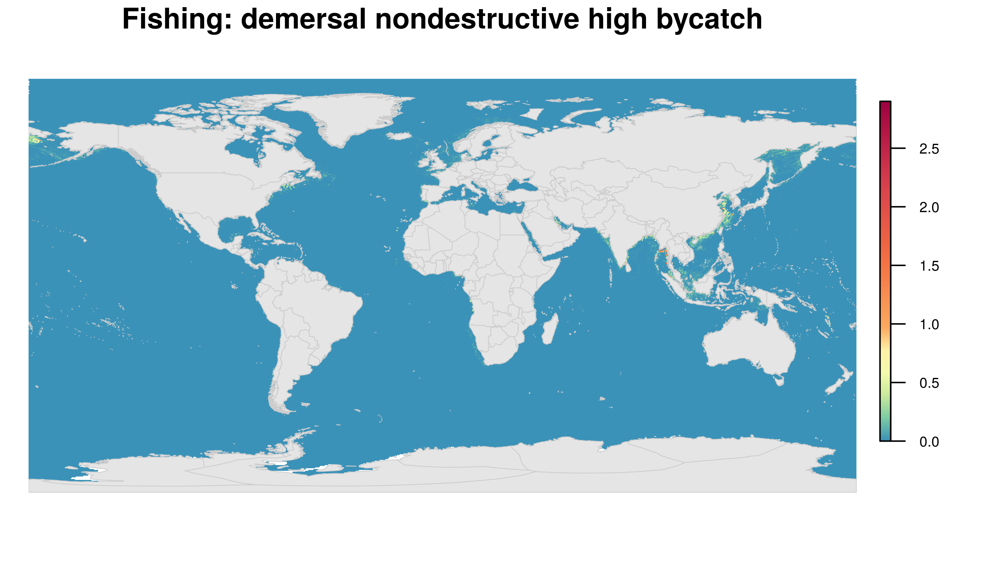
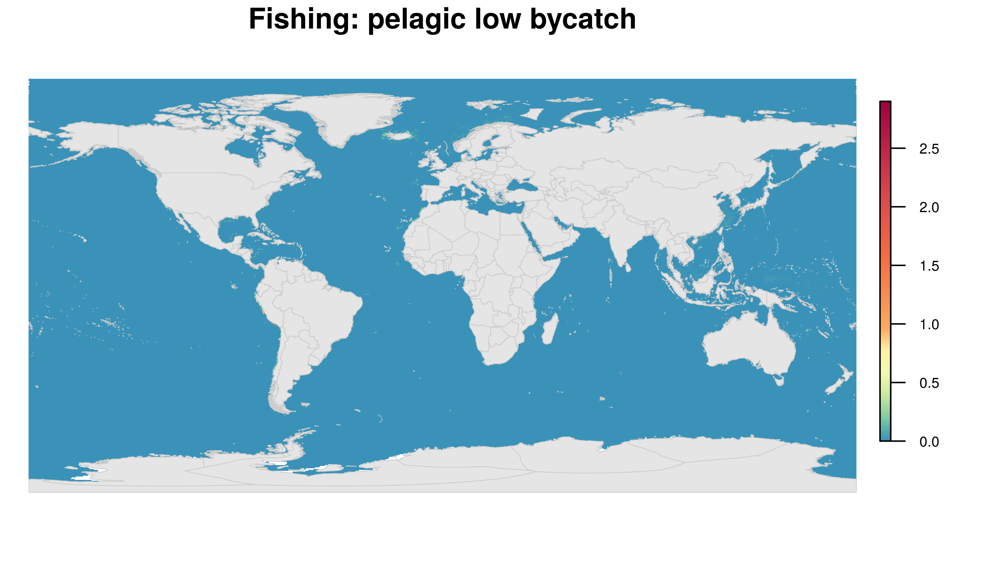
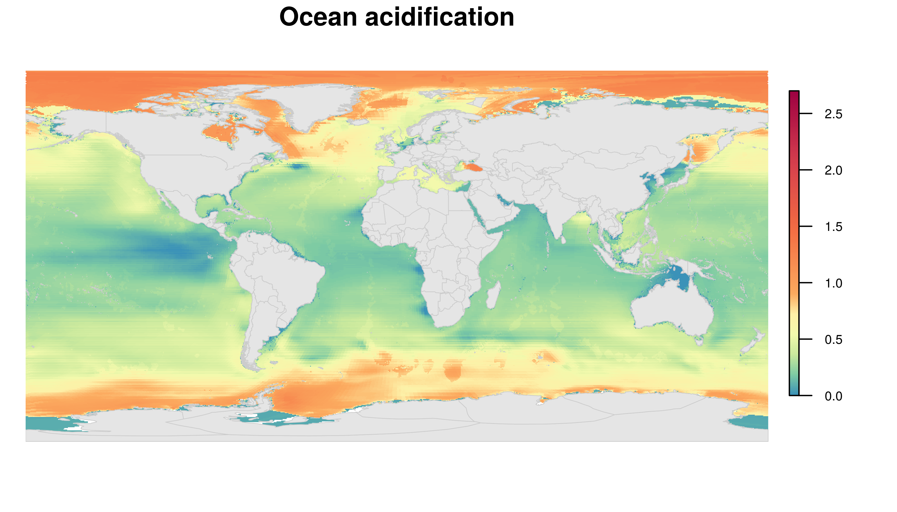
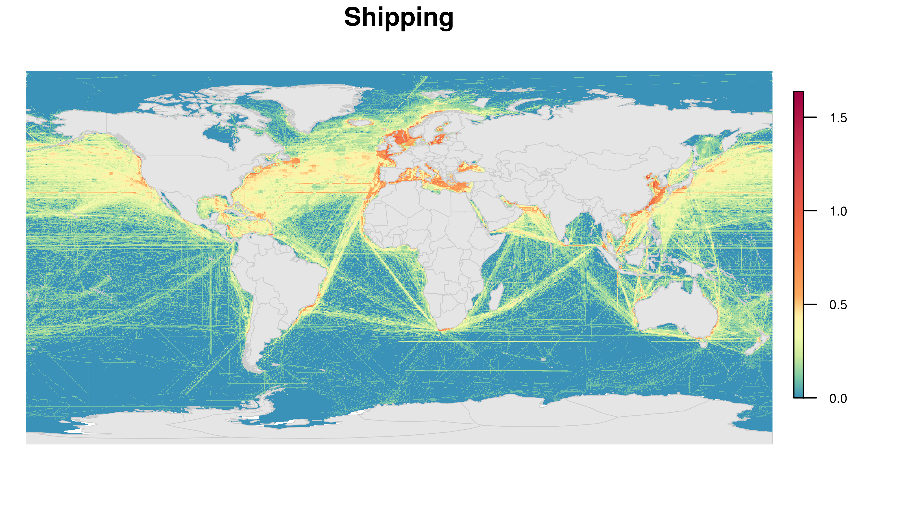

```{r, echo = FALSE, message = FALSE, warning = FALSE, error=FALSE, include=FALSE}

library(tidyr)
library(dplyr)
library(raster)
library(RColorBrewer)
library(rgdal)
library(sf)
library(fields)
library(cowplot)
library(ggplot2)
library(here)
library(beyonce)

source("https://raw.githubusercontent.com/OHI-Science/ohiprep_v2018/master/src/R/spatial_common.R")

regions_shape <- as(regions, "Spatial")
regions_shape <- spTransform(regions_shape, CRS("+init=epsg:4326"))
land <- regions_shape[regions_shape$rgn_type %in% c("land", "land-disputed", "land-noeez", "eez-inland"), ]
land_wgs <- spTransform(land, CRS("+init=epsg:4326"))

bey <- beyonce_palette(49)[c(2, 4:6)]
cols <- colorRampPalette(bey, space="Lab")(100)[20:100]

```

```{r, eval=FALSE, echo = FALSE, message = FALSE, warning = FALSE, error=FALSE, include=FALSE}
# Figures and files made in cpps_Data_explore.Rmd
# move relevant files to FTP site

# Global raster files
## CHI
file.copy(file.path(dir_M, "git-annex/impact_acceleration/impact/figures/chi_lat_long_2013.tif"),
          "../../shares/web/data/htdocs/data/CPPS/global/CHI_2013_global.tif")
## trend
file.copy(file.path(dir_M, "git-annex/impact_acceleration/impact/figures/slope_lat_long.tif"),
          "../../shares/web/data/htdocs/data/CPPS/global/trend_global.tif")
## impacts
impact_list <- list.files(file.path(dir_M, "git-annex/impact_acceleration/impact/figures/impacts_lat_long"),
                          full=TRUE, pattern=".tif")

for(impact in impact_list){ # impact = impact_list[1]
  name <- gsub("latlong_", "", basename(impact))
  name <- gsub(".tif", "", name)
  
  file.copy(impact,
          sprintf("../../shares/web/data/htdocs/data/CPPS/global/%s_global.tif", name))
          
}

## log impacts (fisheries)
impact_list <- list.files(file.path(dir_M, "git-annex/impact_acceleration/impact/figures/impacts_lat_long/log_latlong"),
                          full=TRUE, pattern=".tif")

for(impact in impact_list){ # impact = impact_list[1]
  name <- gsub("latlong_", "", basename(impact))
  name <- gsub(".tif", "", name)
  
  file.copy(impact,
          sprintf("../../shares/web/data/htdocs/data/CPPS/global/%s_global.tif", name))
          
}

```

```{r, eval=FALSE, echo = FALSE, message = FALSE, warning = FALSE, error=FALSE, include=FALSE}
# clipped files
# masked by region
impact_list <- list.files(file.path(dir_M, "git-annex/impact_acceleration/projects/abnj/clipped_files"),
                          full=TRUE, pattern="rgn_only")

# tmp <- raster(impact_list[18])
# tmp
# plot(tmp)

for(impact in impact_list){ # impact = impact_list[1]
  name <- gsub("rgn_only_", "", basename(impact))

  file.copy(impact,
          sprintf("../../shares/web/data/htdocs/data/CPPS/%s", name))
          
}

# put in zip file
setwd("../../shares/web/data/htdocs/data/CPPS") 
zip(zipfile = "masked_cpps", files = list.files(pattern=".tif"))
file.remove(list.files(pattern=".tif"))
setwd(here())


## bounding box region
impact_list <- list.files(file.path(dir_M, "git-annex/impact_acceleration/projects/abnj/clipped_files"),
                          full=TRUE)
impact_list <- grep("rgn_only", impact_list, value=TRUE, invert=TRUE)
# tmp <- raster(impact_list[1])
for(impact in impact_list){ # impact = impact_list[1]
  name <- basename(impact)

  file.copy(impact,
          sprintf("../../shares/web/data/htdocs/data/CPPS/%s", name))
          
}

# put in zip file
setwd("../../shares/web/data/htdocs/data/CPPS") 
zip(zipfile = "boundingbox_cpps", files = list.files(pattern=".tif"))
file.remove(list.files(pattern=".tif"))
setwd(here())

```

This document provides instructions for downloading the impact data and a description of the data files.

We also provide a brief introduction to the methods, but see Halpern et al. [2008](http://science.sciencemag.org/content/319/5865/948) and [2015](https://www.nature.com/articles/ncomms8615) for more information. 


## Download
Data describing cumulative impacts and stressor impacts can be downloaded [here](https://ohi.nceas.ucsb.edu/data/data/CPPS).

Description: spatial tiff files; latitude/longitude; 0.009 &deg;resolution

This location includes three folders:

**global** 21 global tiff files: Cumulative human impacts (CHI), change in CHI (trend), 14 stressor impacts (see description below), logged version of the 5 of the fisheries impacts. All impact data are from the most recent year of data (2013) and trend is calculated from 2003-2013. Extent of all files is -180, 180, -90, 90 (xmin, xmax, ymin, ymax). 

The spatial scale of these data looks like this (note color scale is different from figures we have provided):

```{r, echo = FALSE, message = FALSE, warning = FALSE, error=FALSE}
rast <- raster(file.path(dir_M, "git-annex/impact_acceleration/impact/figures/chi_lat_long_2013.tif"))
plot(rast, col=cols, axes=FALSE, box=FALSE)

```

**boundingbox** zip folder (17 tiff files) with data for region +/-10&deg; extent of CPPS bounding box: Cumulative human impacts (CHI), change in CHI (trend) and significance, 9 stressor impacts (we excluded impacts not relevant to high seas areas), logged version of the 5 of the fisheries impacts. All impact data are from the most recent year of data (2013) and trend is calculated from 2003-2013. Extent of data is: -129.996, -57.276, -70.002, 19.998  (xmin, xmax, ymin, ymax).  

The spatial scale of these data looks like this (note color scale is different from figures we have provided):

```{r, echo = FALSE, message = FALSE, warning = FALSE, error=FALSE}
rast <- raster(file.path(dir_M, "git-annex/impact_acceleration/projects/abnj/clipped_files/chi_cpps.tif"))
plot(rast, col=cols, axes=FALSE, box=FALSE, legend=FALSE)

```

**masked_cpps** zip folder (17 tiff files) with data for area in CPPS region: Cumulative human impacts (CHI), change in CHI (trend) and significance, 9 stressor impacts (we excluded impacts not relevant to high seas areas), logged version of the 5 of the fisheries impacts. All impact data are from the most recent year of data (2013) and trend is calculated from 2003-2013. Extent of files: -129.996, -57.276, -70.002, 19.998. (xmin, xmax, ymin, ymax). 

The spatial scale of these data looks like this (note color scale is different from figures we have provided):

```{r, echo = FALSE, message = FALSE, warning = FALSE, error=FALSE}
rast <- raster(file.path(dir_M, "git-annex/impact_acceleration/projects/abnj/clipped_files/rgn_only_chi_cpps.tif"))
plot(rast, col=cols, axes=FALSE, box=FALSE, legend=FALSE)

```

## File descriptions

The following is a description of the data included in each file.  See below for description of files.

general filename (may vary somewhat)  |  name   |  description    | glimpse
--------- | --------- | --------------- | --------------------- 
CHI/chi       | cumulative human impact (CHI), 2013  | Cumulative impact of 14 stressors on marine habitats  |
trend     | change in CHI over time | linear model trend estimate of CHI from 2003-2013 | 
sig_trend | significance of CHI trend   | values are 1 and NA, 1 values indicate raster cells that do not have a statistically significant trend, used as an overlay on the trend raster | 
dd/dem_dest | commercial fishing: demersal destructive | Impact due to demersal destructive fishing, 2013; also includes a logged version, ln(x+1), indicated by "log" or "ln" prefix | 
dnd_hb/dem_nondest_hb | commercial fishing: demersal nondestructive high bycatch| Impact due to demersal nondestructive high bycatch fishing, 2013; also includes a logged version, ln(x+1), indicated by "log" or "ln" prefix | 
dnd_lb/dem_nondest_lb | commercial fishing: demersal nondestructive low bycatch| Impact due to demersal nondestructive low bycatch fishing, 2013; also includes a logged version, ln(x+1), indicated by "log" or "ln" prefix | 
pel_hb | commercial fishing: pelagic high bycatch| Impact due to pelagic high bycatch fishing, 2013; also includes a logged version, ln(x+1), indicated by "log" or "ln" prefix | 
pel_lb | commercial fishing: pelagic low bycatch| Impact due to pelagic low bycatch fishing, 2013; also includes a logged version, ln(x+1), indicated by "log" or "ln" prefix | 
art_fish | artisanal fishing | impact due to artisanal fishing, 2013 | Not relevant to high seas  
sst | sea surface temperature | Impact due to increasing extreme temperature events, 2013 | 
oa | ocean acidification | Impact due to increasing ocean acidity, 2013 | 
slr | sea level rise | Impact due to rising mean sea level, 2013; Not significant impact for most high seas regions | 
shipping | shipping | Impact due to shipping pressures, 2013 | 
nutrient | nutrient pollution | Impact due to nutrient (e.g., fertilizer) run-off from terrestrial environments, 2013 | Typically not relevant to high seas 
organic | organic chemical pollution | Impact due to organic chemical (e.g., pesticides) run-off from terrestrial environments, 2013 | Typically not relevant to high seas 
direct_human | direct human impacts | Impact on coastal habitats due to direct human influence such as trampling, 2013 | Not relevant to high seas
light | light pollution | Impact due to artificial lights, 2013 | Typically not relevant to high seas 


## Methods

###  General model
We measure cumulative impact $I_{c}$ at a ~1km resolution, using the following information:

1. Stressor rasters describe the magnitude of each of 14 stressors on a scale of 0-1 (1 is highest relative stress). 
2. Habitat rasters describe the location (1 if present, otherwise NA) of 21 global marine ecosystem types.
3. Vulnerability matrix describes the vulnerability of each habitat to each stressor.  Vulnerability is a value from 1-3.

Impacts are calculated as:

1. For every stressor/habitat combination, multiply stressor, $D_{j}$, and habitat, $E_{i}$, rasters and  corresponding vulnerability, $mu _{ij}$.
2. Average impact of each stressor, $I_{s}$ is calculated by summing the stressor x habitat x vulnerability rasters for all habitats and then dividing by the number of habitats ($m$) in each cell:

$$I_{s} = 
{\frac{1}{m} \sum\limits_{i=1}^{m}{D_{j} \times E_{i} \times} \mu _{ij}}$$


3. The Cumulative Impact, $I_{c}$, is calculated by summing the stressor impact rasters:
$$I_{c} = 
{\sum\limits_{i=1}^{m}{I_{s}}}$$

### Stressors
We include stressors from 4 primary categories:

* Fishing: commercial demersal destructive, commercial demersal nondestructive high bycatch, commercial demersal nondestructive low bycatch, pelagic high bycatch, pelagic low bycatch, artisanal
* Climate change: sea surface temperature, ocean acidification, sea level rise
* Ocean: shipping
* Land-based: nutrient pollution, organic chemical pollution, direct human, light

Stressors are rescaled to have values between 0-1.  In most cases, this is achieved by dividing the values from the 99.99th quantile across raster cells and years (values are capped to a maximum value of 1). We rescaled data in this way to ensure comparability across time periods (that is, using the same reference point across time). Rescaling allows for direct comparison among drivers with dramatically different units of measurement.

##### Fishing

*Commercial fishing (5 stressors)*

Commercial fishing stressors are determined for 5 broad categories of fisheries based on gear type: demersal destructive (e.g., bottom trawl), demersal non-destructive high bycatch (e.g., pots, traps), demersal non-destructive low bycatch (e.g., hook and line), pelagic high bycatch (e.g., long-line), and pelagic low bycatch (e.g., hook and line).  The stressor was calculated using annual wild caught fisheries catch by gear type data at 0.5&deg; resolution (Watson 2017).

Catch (landings) data are only a proxy for the potential stress of fishing on marine ecosystems because it is the effort to land the catch that determines stress. For example, an area with low fish densities would have to be trawled many more times to harvest an equal catch to an area with higher fish densities. To attempt to control for this issue, we standardize catch by Net Primary Productivity (Behrenfeld and Falkowski 1997). 

*Artisanal fishing*

The artisanal fishing stressor is based on small scale fisheries.  Small scale fisheries catch data were obtained at 0.5&deg resolution; (Watson 2017). Otherwise, the methods are the same as those described for commercial fisheries.

##### Climate change

*Sea surface temperature*

The sea surface temperature (SST) stressor describes the increased frequency of extreme temperature events.  The data were obtained from version 5 of the Coral Reef Temperature Anomaly Database (CoRTAD) These data are a product of the NOAA National Oceanographic Data Center, produced using Advanced Very High Resolution Radiometer (AVHRR) Pathfinder Version 5.2 SST data (www.nodc.noaa.gov/SatelliteData/CoRTAD). 

The number of extreme SST weeks during a five year period is subtracted from the number of extreme SST weeks during a five year reference period (1985-1989). An extreme week was defined as one that exceeds the standard deviation (SD) of SSTs from the climatology for that location (i.e., grid cell) and week of the year, calculated across all years of data (1982-2012). Extreme events were calculated in only the positive (warming) direction.

Some of the local-scale changes in SST anomalies could be due to natural variation and not a consequence of long-term human induced climate change. 

*Ocean acidification*

The ocean acidification stressor describes the magnitude of decreasing aragonite saturation state ($\Omega_{arag}$)(Feely et al. 2009) due to increasing atmospheric CO~2~ levels from human influences. When values are $\leq$ 1, the threshold at which seawater becomes undersaturated, the pressure is classified as 1.  For values >1, rescaling is based on the change in saturation relative to the reference period (average from 1880-1889). 

*Sea level rise*

The sea level rise stressor describes the magnitude of increasing sea level (mm) due to loss of sea ice.  The data are derived from satellite altimetry data  ([http://www.aviso.altimetry.fr/en/data/products/sea-surface-height-products/global/msla-mean-climatology.html](http://www.aviso.altimetry.fr/en/data/products/sea-surface-height-products/global/msla-mean-climatology.html)) at a 0.25x0.25&deg; resolution. Monthly mean sea level anomalies were defined as meters above mean sea level, with mean sea level calculated using a reference period from 1993-2012.  Monthly values were averaged across pixels to get annual sea level rise anomalies. A running 5 year mean of annual data was used to smooth large yearly variation. All negative values were set to zero (i.e., no negative pressure), such that only positive sea level rise values are considered.

##### Ocean-based

*Shipping*

Shipping describes intensity of shipping traffic throughout the ocean.  We used two sources of data to derive these data.  First we used a high resolution (0.1&deg;) baseline map of vessel traffic obtained using data from the the Volunteer Observing System (VOS) and Automatic Identification System (AIS) (data from Halpern et al. 2015).  These data combine several years of shipping data, but most is from 2011. Second, to estimate change over time, we used Tournadre (2018) data with annual ship densities at 1 x 2&deg; resolution.  We only use the Tournadre data to derive the correction factor because the data has relatively low resolution and is stochastic.

Both datasets were resampled to ~1km grid cells (using nearest neighbor estimates of cell values).  Yearly shipping data from Tournadre is used to create yearly rasters describing the proportional change in shipping relative to 2011 (which corresponds to the year with the bulk of our shipping data).  To control for stochasticity of these data we averaged 3 year time periods for each year.

We then multiplied the baseline shipping raster (Halpern et al. 2015) with each of the rasters describing the proportional change in shipping.  

Data were ln(x+1) transformed.


##### Land-based

*Nutrient pollution*

The nutrient pollution stressor describes the amount of nutrient pollution from land-based applications and run-off.  We used fertilizer data as a proxy for general nutrient pollution. Data for country level fertilizer use is available from FAO.  We estimated missing fertilizer values using a linear regression model with pesticides as a predictor when available, and, agricultural GDP when unavailable. The country-level average fertilizer values were then dasymetrically distributed over a country’s landscape using global land cover data from 2009, derived from the Moderate Resolution imaging Spectroradiometer (MODIS) instrument at ~500m resolution. These values were then aggregated by ~140,000 global basins, and diffusive plumes were modeled from each basin’s pourpoint. The final non-zero plumes (about ~76,000) were aggregated into ~1km^2^ rasters in the Mollweide projection (WGS1984 datum) to produce a single plume aggregated pollution raster. These raw values were then ln(x+1) transformed and normalized to 0-1.

*Organic chemical pollution*

The organic chemical pollution stressor describes the amount of organic chemical pollution from land-based applications and run-off.  We use FAO data describing country-level pesticide use as a proxy measure for organic pollution. Otherwise, the methods are the same as those for nutrient pollution. 

*Direct human*

The direct human stressor estimates the magnitude of direct human interactions on coastal and near-coastal habitats, such as trampling.  This was estimated using human density data at 30 arc-second resolution (Gridded Population of the World Population Count Grid, v4, from the Center for International Earth Science Information) for years 2005, 2010, 2015, and 2020.  Data were resampled to ~1 km grid and intervening years of data were linearly interpolated.  We summed the coastal human population, defined as the number of people within a moving circular window around an arbitrary focal coastal cell of radius 10 km.  Data were cropped to include only cells 1km from the coast because this stressor primarily affects intertidal and very nearshore ecosystems.  Values were ln(x+1) transformed.

*Light*

The light stressor describes the amount of light pollution in marine environments. We used annual DMSP stable night lights satellite data (image and data processing by NOAA's National Geophysical Data Center; DMSP satellite data collected by US Air Force Weather Agency) with resolution of 30 arc-second. The original data contained non-calibrated radiance values of 0-63. We applied a calibration technique developed elsewhere to make the data more comparable among years/satellites (Elvidge et al. 2009). 

This formula is based on the assumption that a reference area (around Sicily) has not changed much in light output in recent years. Lowest values (non-lit areas) were replaced with zeros. This technique, while not perfect, does allow for better comparison between different satellites and time periods.

##### Data sources

*Table 1: Data sources for stressor data*

stressor  | source               | short description | spatial resolution  | temporal resolution
---------- | ------------------ | ---------------- | ------------------- | ------------------
sea surface temperature  | Selig et al. 2010 | SST and SST anomalies | approximately 4.6 km at the equator    | weekly, 1982-2012
ocean acidification | Feely et al. 2009   | aragonite saturation state | 1&deg; | monthly, 1880-2020
sea level rise     | [Aviso](http://www.aviso.altimetry.fr/en/data/products/sea-surface-height-products/global/msla-mean-climatology.html)  | sea level anomalies (meters above mean sea level) | 0.25&deg; | monthly, 1993-2016
fishing: artisanal |  Watson 2017 (catch data); Behrenfeld and Falkowski 1997 (net primary productivity) | catch: tonnes of fish stock/fishing method; NPP: C/m2/day | catch: 0.5&deg;; NPP: 0.83&deg; | catch: yearly, ; NPP: monthly   
fishing: demersal destructive |  Watson 2017 (catch data); Behrenfeld and Falkowski 1997 (net primary productivity); and Halpern et al. 2008 (used to classify gear types) | catch: tonnes of fish stock/fishing method; NPP: C/m2/day | catch: 0.5&deg;; NPP: 0.83&deg; | catch: yearly, ; NPP: monthly   
fishing: demersal nondestructive high bycatch |  Watson 2017 (catch data); Behrenfeld and Falkowski 1997 (net primary productivity); and Halpern et al. 2008 (used to classify gear types) | catch: tonnes of fish stock/fishing method; NPP: C/m2/day | catch: 0.5&deg;; NPP: 0.83&deg; | catch: yearly, ; NPP: monthly   
fishing: demersal nondestructive low bycatch |  Watson 2017 (catch data); Behrenfeld and Falkowski 1997 (net primary productivity); and Halpern et al. 2008 (used to classify gear types) | catch: tonnes of fish stock/fishing method; NPP: C/m2/day | catch: 0.5&deg;; NPP: 0.83&deg; | catch: yearly, ; NPP: monthly   
fishing: pelagic high bycatch |  Watson 2017 (catch data); Behrenfeld and Falkowski 1997 (net primary productivity); and Halpern et al. 2008 (used to classify gear types) | catch: tonnes of fish stock/fishing method; NPP: C/m2/day | catch: 0.5&deg;; NPP: 0.83&deg; | catch: yearly, ; NPP: monthly   
fishing: pelagic low bycatch |  Watson 2017 (catch data); Behrenfeld and Falkowski 1997 (net primary productivity); and Halpern et al. 2008 (used to classify gear types) | catch: tonnes of fish stock/fishing method; NPP: C/m2/day | catch: 0.5&deg;; NPP: 0.83&deg; | catch: yearly; NPP: monthly   
nutrient pollution (runoff) | fertilizer use: [FAO](http://faostat3.fao.org/faostat-gateway/go/to/browse/R/*/E); land cover: Loveland et al. 2000 ; Plume model: Halpern et al. 2008 | modeled from FAO country fertilizer use, land-use data and elevation data | ~ 1km  | Fertilizer use: yearly; land-use: one year
organic chemical pollution (runoff) | pesticide use: [FAO](http://faostat3.fao.org/faostat-gateway/go/to/browse/R/*/E); land cover: Loveland et al. 2000; Plume model: Halpern et al. 2008 | modeled from FAO country pesticide use, land-use data and elevation data | ~ 1km  | Pesticide data: yearly; land-use: one year
direct human | CIESIN 2016 | Human density from Gridded Population of the World (GPW) Population Count Grid Future Estimates (v4) | 30 arc-second | 2005, 2010, 2015, and 2020
Light  | Elvidge et al. 2009 | DMSP satellite data (Image and data processing by NOAA's National Geophysical Data Center) | 30 arc-second spanning -180 to 180 degrees longitude and -65 to 75 degrees latitude | yearly
Shipping | Halpern et al. 2015; Tournadre 2018 | Tournadre data provides yearly change estimates with coarse resolution was used to adjust high resolution shipping data | Halpern: 0.1&deg;; Tournadre: 1x2&deg; | Halpern: combined years (mostly 2011); Tournadre: yearly, 1992-2016


## References

AVISO (2016). Satellite Alimetry Data: Mean sea level rise. https://www.aviso.altimetry.fr/en/data/products/sea-surface-height-products/global/msla-mean-climatology.html

Behrenfeld, M.J., and Falkowski, P.G. (1997). Photosynthetic rates derived from satellite-based chlorophyll concentration. Limnology and Oceanography 42, 1–20.

Center for International Earth Science Information Network - CIESIN - Columbia University (2016). Gridded Population of the World, Version 4 (GPWv4): Administrative Unit Center Points with Population Estimates. Palisades, NY: NASA Socioeconomic Data and Applications Center (SEDAC). http://dx.doi.org/10.7927/H4F47M2C

Elvidge, C.D., Ziskin, D., Baugh, K.E., Tuttle, B.T., Ghosh, T., Pack, D.W., Erwin, E.H., and Zhizhin, M. (2009). A Fifteen Year Record of Global Natural Gas Flaring Derived from Satellite Data. Energies 2, 595–622.

Feely, R., Doney, S., and Cooley, S. (2009). Ocean acidification: present conditions and future changes in a high-CO2 world. Oceanography 22, 36–47.

Halpern, B.S., Walbridge, S., Selkoe, K.A., Kappel, C.V., Micheli, F., D’Agrosa, C., Bruno, J.F., Casey, K.S., Ebert, C., Fox, H.E., et al. (2008). A Global Map of Human Impact on Marine Ecosystems. Science 319, 948–952.

Halpern, B.S., Frazier, M., Potapenko, J., Casey, K.S., Koenig, K., Longo, C., Lowndes, J.S., Rockwood, R.C., Selig, E.R., Selkoe, K.A., et al. (2015). Spatial and temporal changes in cumulative human impacts on the world’s ocean. Nat Commun 6, 7615.

Loveland, T.R., Reed, B.C., Brown, J.F., Ohlen, D.O., Zhu, Z., Yang, L., and Merchant, J.W. (2000). Development of a global land cover characteristics database and IGBP DISCover from 1 km AVHRR data. International Journal of Remote Sensing 21, 1303–1330.

Selig, E.R., Casey, K.S., and Bruno, J.F. (2010). New insights into global patterns of ocean temperature anomalies: implications for coral reef health and management. Global Ecology and Biogeography 19, 397–411.

Tournadre, J. (2014). Anthropogenic pressure on the open ocean: The growth of ship traffic revealed by altimeter data analysis. Geophysical Research Letters 41, 7924–7932.

United Nations (2016). FAO Statistics Division - Inputs. http://faostat3.fao.org/browse/R/*/E

Watson, R.A. (2017). A database of global marine commercial, small-scale, illegal and unreported fisheries catch 1950–2014. Scientific Data 4, 170039.

